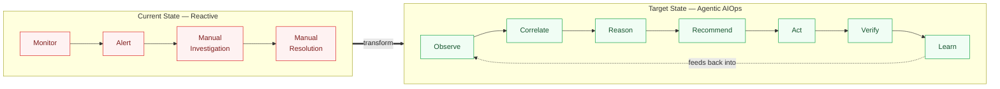
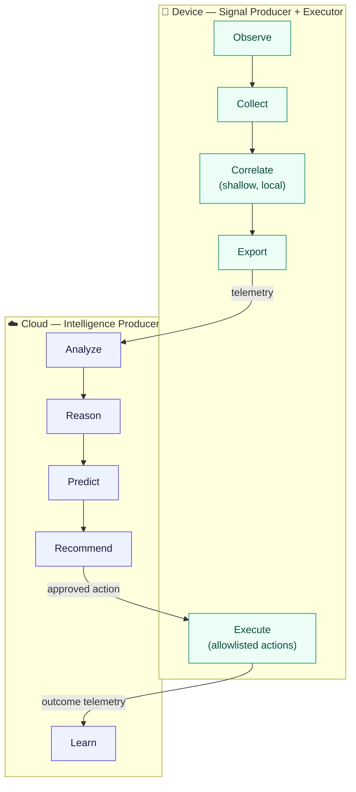

# Architecture Vision & Strategy
## RDK Agentic AI Platform — Hybrid Cloud/Edge

**Document Version:** 1.0
**Document Type:** Architecture Vision & Strategy (precedes High-Level Design)
**Companion Document:** [Final_SRD_Agentic_AI_RDK_Hybrid.md](./Final_SRD_Agentic_AI_RDK_Hybrid.md)
**Audience:** Architecture review board, platform leadership, device/cloud engineering leads

---

## 1. Purpose of This Document

The SRD defines *what* the system must do. This document defines *why the architecture is shaped the way it is* — the principles, constraints, and strategic decisions that every subsequent HLD/LLD choice must trace back to. Its job is to make disagreements in later design reviews resolvable ("does this violate a principle?") rather than re-litigated from scratch.

This is a **strategy document, not a design document**. It contains no component diagrams or interface schemas — those belong in the HLD.

---

## 2. Business Context & Drivers

- ISPs need to move from reactive support (alert → truck roll) to proactive, automated operations — the Airties Aura model demonstrates the commercial upside (FCR, churn, NPS, MTTR).
- The installed base is dominated by **legacy-to-mid-generation RDK gateways** (2-core ARMv7, ~750MB RAM) that will not be replaced fleet-wide for years. Any architecture that assumes next-generation hardware is not deployable at the scale that matters commercially.
- RDK already provides ~80% of the required telemetry and control surface (OneWiFi, WAN Manager, T2, WebPA, RBUS, RFC) — the gap is the **reasoning and orchestration layer**, not raw data access.
- Regulatory and subscriber-trust exposure from autonomous action on a customer's home network is real and non-trivial — architecture must treat safety as a first-class constraint, not an add-on.

---

## 3. Vision Statement

> Build an Agentic AIOps platform where **every currently-deployed RDK gateway can participate**, by keeping the device a disciplined signal producer and safe action executor, while all reasoning, learning, and orchestration intelligence lives in the cloud — so that fleet-wide autonomous operations become possible without a hardware refresh cycle.

Target transformation:

```
Monitor → Alert → Manual Investigation → Manual Resolution        (current)
Observe → Correlate → Reason → Recommend → Act → Verify → Learn   (target)
```



---

## 4. Guiding Architectural Principles

These are durable and apply regardless of which specific technology is chosen in HLD. Every design decision downstream should be checked against these.

### P1 — Collect at the edge, think in the cloud, act on the device
The device never hosts reasoning (LLM, knowledge graph, multi-agent orchestration). The device never stays silent either — it always executes the final action, because only the device has direct access to RDK control APIs. This is the single most load-bearing principle in the entire architecture; it is what makes the platform deployable on today's fleet.



### P2 — The device is resource-budgeted like an embedded system, not a server
Every device-side component ships with an explicit RSS/CPU/flash ceiling, both a soft target and a hard process limit, measured against the actual reference hardware — not a generic cloud-native sizing assumption. No component is "best effort" on memory.

### P3 — Safety and reversibility gate autonomy, not confidence score alone
A high AI confidence score is necessary but not sufficient to auto-execute. Autonomy is granted per-action-type through an explicit allowlist and is separately gated by blast radius (single device vs. fleet) and reversibility (rollback available vs. not). Irreversible, high-blast-radius actions (factory reset, firmware rollback, mass config change) remain human-gated indefinitely in this architecture, not just in the MVP phase.

### P4 — Every AI decision is explainable and auditable by construction
Explainability is not a reporting feature bolted on later — the schema for a recommendation (Section 8 of the SRD) *requires* reason, confidence, and evidence fields to exist before an action can be dispatched. An action with no rationale cannot enter the system.

### P5 — Telemetry volume is a cost to be minimized, not a resource to be maximized
Default to event-triggered, adaptively-sampled telemetry over continuous tracing. The architecture treats "send everything" as a failure mode (network saturation, storage explosion, collector congestion), not a safety margin.

### P6 — Reuse existing RDK subsystems; do not re-platform the device
Where RDK already exposes a capability (WAN Manager for connectivity, OneWiFi for radio control, PAM for reboot), the architecture wraps and instruments it — it does not replace it with a new abstraction. New device-side code is added only where no RDK equivalent exists (collector, action gateway, rule evaluator).

### P7 — Disabled means truly disabled
Any agentic capability must ship with a working off switch (RFC-controlled) that returns the device to baseline: no listener, no export, no background process, memory released. This is a hard architectural requirement, not an operational nicety — it is what makes staged rollout and fast incident rollback possible.

### P8 — Portability across RDK profiles and operators is a constraint, not an aspiration
Different operators run different HALs, Wi-Fi stacks, and cloud integrations. The architecture isolates device-specific logic behind RDK's existing abstraction layers (RBUS/CCSP/HAL) so the cloud-side agent logic does not need per-operator forks.

---

## 5. Strategic Architecture by Domain

### 5.1 Device Tier Strategy
- **Role:** signal producer + action executor only.
- **Language/runtime:** native C/C++, ARMv7-targeted — explicitly *not* the general-purpose Go OTEL Collector, which is too heavy for this class of device.
- **State:** device holds only short-lived buffers/queues and a small local cache (recent incidents, known remediation signatures) — never a full knowledge graph or model.
- **Decision authority:** device may self-approve only allowlisted, low-risk, reversible actions under locally-evaluated deterministic rules; everything else waits for a cloud decision.

### 5.2 Cloud Tier Strategy
- **Role:** all reasoning, correlation, learning, and orchestration.
- **Composition:** multi-agent framework (Network/Device/Care/Marketing/Security/Operations agents) sitting on top of a knowledge graph and LLM/reasoning engine, with a policy engine mediating between recommendation and action.
- **Scale assumption:** must be designed for tens of millions of subscribers / hundreds of millions of devices from day one — this is a cloud-native, horizontally-scaled system, unconstrained by the device tier's budget.

### 5.3 Telemetry & Data Strategy
- OTLP as the universal wire format between device and cloud.
- Minimal, standardized span/event schemas (one shape per category, not one shape per RDK component) to prevent schema sprawl as more components are instrumented.
- Sampling strategy is dynamic and incident-aware (baseline ~1%, escalating toward 100% during a detected incident) rather than static.
- PII exclusion is enforced at the point of telemetry generation on the device, not filtered downstream in the cloud — data that should never exist is never created.

### 5.4 AI & Reasoning Strategy
- Generative AI, RAG, and multi-agent orchestration are **cloud-exclusive** for the foreseeable hardware roadmap (see Hardware Capability Assessment in the SRD, Section 5). This is a standing architectural decision, not a temporary MVP limitation, unless a future hardware profile (Profile C, NPU-equipped) is formally adopted.
- Local AI on the device is limited to lightweight, classical ML (decision trees, isolation forests) for anomaly detection — never generative or LLM-based.
- Every recommendation the reasoning engine produces must carry a confidence score and be traceable to the source telemetry that produced it.

### 5.5 Security Strategy
- mTLS/OAuth/JWT-based device authentication; TLS 1.2+ in transit; least-privilege applied independently to the collector and the action gateway (a compromised collector must not be able to execute actions, and vice versa).
- Action APIs are replay-protected and idempotent by design (unique action ID), not by convention.
- Audit trail is immutable and append-only, owned outside the components it audits.

### 5.6 Integration Strategy
- RDK's existing IPC fabric (RBUS, CCSP, WebPA, Thunder) is the integration backbone; the architecture adds trace-context propagation (W3C Trace Context) across it rather than introducing a parallel communication path.
- Cloud-side integration follows existing observability tooling conventions (OpenTelemetry-native, works with Grafana/Tempo/Jaeger/Elastic/Splunk-class backends) rather than a bespoke telemetry protocol.

---

## 6. Key Strategic Decisions (Architecture Decision Log — Summary Level)

| # | Decision | Rationale | Status |
|---|---|---|---|
| AD-01 | Hybrid edge-collection + cloud-reasoning model over full edge-resident AI or pure cloud-only monitoring | Only model deployable on current fleet hardware while still enabling agentic behavior | **Adopted** |
| AD-02 | C/C++ lightweight collector, not general-purpose Go OTEL Collector, on-device | Go collector's memory/runtime footprint incompatible with the device budget | **Adopted** |
| AD-03 | Explicit action allowlist + human approval for irreversible/high-blast-radius actions, permanently (not just MVP) | Regulatory and subscriber-trust exposure of autonomous home-network changes | **Adopted** |
| AD-04 | Event-triggered, adaptively-sampled telemetry as the default, not continuous tracing | Trace-volume explosion identified as a top technical risk at fleet scale | **Adopted** |
| AD-05 | Device-local knowledge cache instead of full graph database on-device | Full knowledge graph infeasible in device RAM budget; graph lives cloud-side only | **Adopted** |
| AD-06 | RFC-gated, disabled-by-default rollout with guaranteed no-op path | Enables staged rollout and instant rollback without firmware update | **Adopted** |
| AD-07 | Cloud AI/LLM platform selection (Azure OpenAI vs. internal LLM vs. hybrid) | Affects cost, latency, and data-residency posture | **Open — pending Section 8** |
| AD-08 | OTEL backend selection (Tempo/Jaeger/Grafana/Datadog/Splunk) | Affects retention cost and query tooling | **Open — pending Section 8** |
| AD-09 | Governance model for MVP: "AI Suggests, Human Approves" vs. "AI Executes, Human Audits" | Determines initial trust posture and liability exposure | **Open — recommend starting with AI-Suggests for all but the lowest-risk action class** |

---

## 7. Non-Negotiable Constraints

These are hard boundaries the architecture must respect; HLD/LLD proposals that violate them require this document to be revised first, not silently overridden.

1. Device-side aggregate footprint must stay within the hard limits defined in SRD Section 2.3 (≤40 MiB steady RSS, ≤56 MiB peak, ≤5% avg CPU) on the reference ARMv7 hardware class.
2. No LLM, vector database, knowledge graph, or multi-agent runtime may be deployed on-device under the current hardware roadmap.
3. Factory reset, firmware rollback, mass/fleet-wide configuration changes, and firewall-policy replacement may never execute without explicit approval — this constraint is architectural, not configurable away by policy.
4. Every automated action must be reversible-or-audited: either a rollback path exists, or the action is excluded from autonomy.
5. Disabling the platform (RFC off) must return the device to a measurably inert state within the tolerances in SRD Section 2.3.

---

## 8. Strategic Decisions Requiring Ratification Before HLD Finalization

The following are business/technical choices this document intentionally leaves open — they are decisions for architecture review board + platform leadership, not engineering defaults:

1. **Cloud AI platform** — Azure OpenAI, an internal/self-hosted LLM, or a hybrid multi-provider approach. Drives cost model, data residency, and latency.
2. **OTEL backend** — Grafana/Tempo, Jaeger, Datadog, or Splunk. Drives retention cost and existing-tooling reuse.
3. **Governance starting posture** — confirm MVP launches as "AI Suggests, Human Approves" across all action classes, with a defined, metric-gated graduation path to autonomous execution for the lowest-risk class only.
4. **Knowledge graph technology** — graph database (e.g., Neo4j), document/relational hybrid, or data-lake-backed — affects query latency for real-time root-cause analysis.
5. **Multi-tenant boundary** — how strictly operator data/models are isolated in the shared cloud platform (affects AD-07 and AD-08 cost/architecture jointly).

These should be resolved as formal ADRs (one decision record per item) and folded into the HLD as accepted inputs, not re-opened during detailed design.

---

## 9. Risk Posture at the Strategy Level

| Risk | Strategic Mitigation |
|---|---|
| Device resource constraints block deployment on older fleet | P1/P2 — hybrid model with hard budgets is the core design response |
| Fleet-wide automation mistake propagates a bad decision to millions of gateways | P3 + AD-03 — human gate on irreversible/high-blast-radius actions, canary + staged rollout mandatory (see SRD FR-SAFE-007) |
| Subscriber distrust of autonomous changes | P4 — explainability by construction, transparent notification required in HLD |
| Multi-vendor RDK variation breaks agent portability | P6/P8 — integrate through existing RDK abstraction layers only |
| Telemetry volume overwhelms network/storage at fleet scale | P5 — adaptive sampling and event-triggered tracing as defaults, not opt-in |

---

## 10. How This Document Is Used

- **HLD** must reference the principle(s) (P1–P8) and decision(s) (AD-01–AD-09) that justify each major component and interface choice.
- **LLD** inherits constraints from Section 7 directly — a module design that cannot fit inside them is out of scope until this document changes.
- Any proposal to violate a principle or constraint (e.g., "run a small LLM on next-gen hardware") should be raised as a new ADR against this document, not implemented ad hoc in design or code.
- This document should be revisited when the hardware roadmap changes (e.g., Profile B/C adoption), not on a fixed cadence.

---

*This document precedes and governs the High-Level Design. It should be reviewed and ratified by the architecture review board before HLD work begins, per Section 8's open decisions.*
