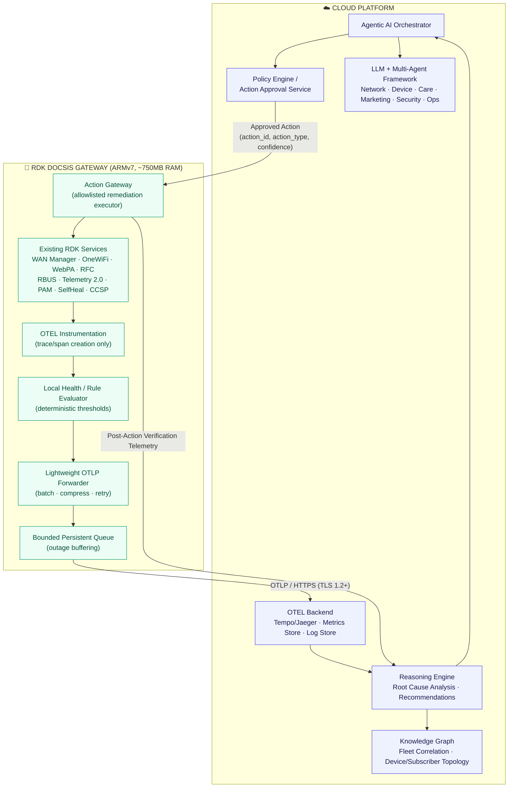
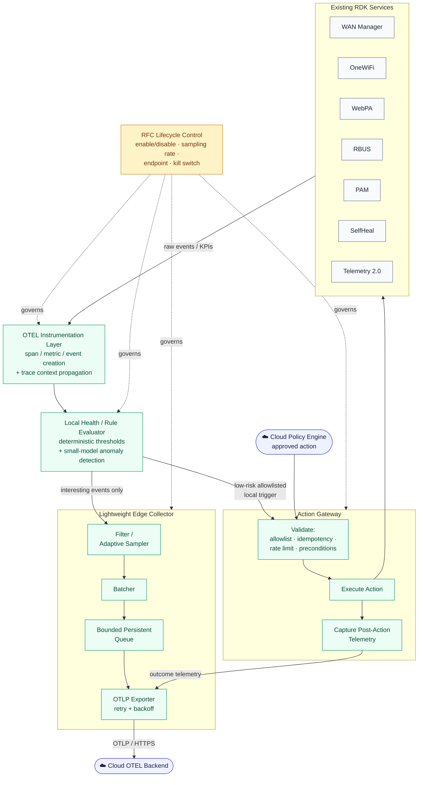
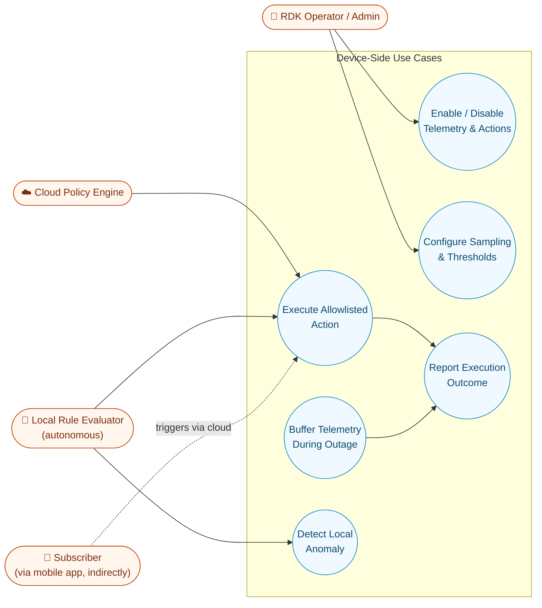
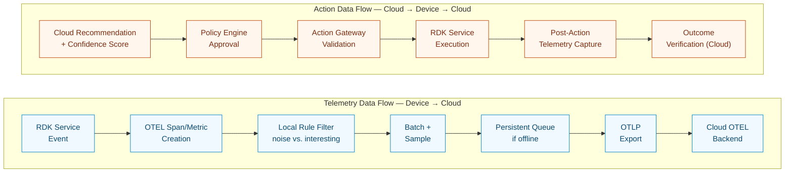
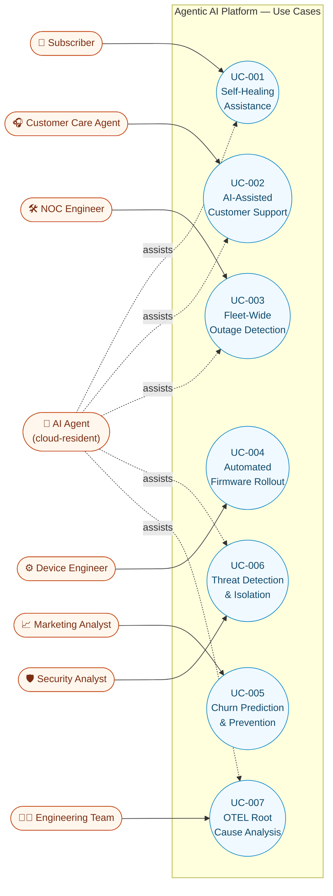
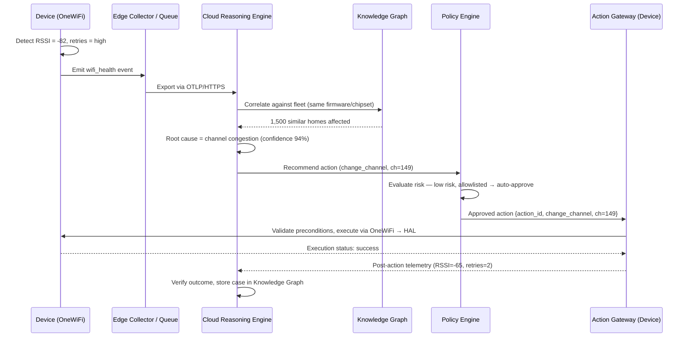
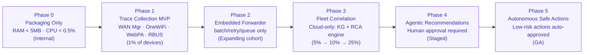

# Software Requirements Document
## Agentic AI Platform for RDK Broadband Gateways — Hybrid Cloud/Edge Architecture

**Document Version:** 1.0 (Consolidated Final)
**Document Type:** Software Requirements Document (SRD), IEEE 29148–aligned structure
**Product Name:** RDK Agentic AI Connectivity Intelligence Platform
**Target Platform:** RDK-B DOCSIS/broadband gateway, resource-constrained embedded class
**Source Basis:** Consolidated from 15 working documents — executive summary, requirement drafts, SRS, functional/non-functional requirement sets, hardware assessments, gap analysis, RDK component mapping, architecture proposals, OTLP schema design, use cases, capacity assessment, and measured baseline data.

---

## 1. Introduction

### 1.1 Purpose

This document defines the consolidated software requirements for an **Agentic AI platform** (inspired by Airties Aura) that enables ISPs/broadband operators to autonomously observe, reason about, and remediate connectivity, device, application, and subscriber-experience issues on **RDK-based broadband gateways**.

Unlike a cloud-first SRS written for unconstrained infrastructure, this document is scoped specifically to a **real, measured embedded device class** — a legacy-to-mid-generation ARMv7 DOCSIS gateway with ~750 MB total RAM and ~256 MB available headroom — and defines what may run **on-device** versus what must remain **cloud-resident**.

### 1.2 Governing Architecture Principle

> **"Collect at the edge, think in the cloud, act on the device."**

The device is a **signal producer and action executor**. The cloud is the **intelligence producer**. This principle is non-negotiable for the target hardware class and governs every requirement below.

```
Reactive Model (today):   Monitor → Alert → Manual Investigation → Manual Resolution
Target Model (Agentic):   Observe → Correlate → Reason → Recommend → Act → Verify → Learn
```

### 1.3 Scope

The platform shall support:
- Residential and SMB broadband, Wi-Fi, and IoT ecosystems on RDK-B gateways
- Telemetry collection, correlation, AI-driven diagnostics, agent-based automation, subscriber self-healing, customer care intelligence, NOC automation, and security anomaly detection
- A hybrid execution model: lightweight, deterministic device-side logic + full agentic reasoning in the cloud
- Fleet scale of tens of millions of subscribers / hundreds of millions of devices at the cloud tier, while remaining within single-digit-MiB/CPU% budgets at the device tier

### 1.4 Out of Scope (for this hardware class)

The following are **explicitly excluded from the device** and remain cloud-only, per hardware assessment (Section 5):
- LLM inference or any generative AI
- Vector databases / RAG pipelines
- Knowledge graphs (beyond a small local cache)
- Multi-agent orchestration frameworks (CrewAI, AutoGen, LangGraph, Semantic Kernel Agents, etc.)
- Natural-language reasoning or conversational AI
- Model training

---

## 2. Target Hardware Profile (Authoritative Baseline)

### 2.1 Measured Reference Device

| Resource | Measured Value | Planning Interpretation |
|---|---|---|
| Physical RAM | 749,296 kB (~731.7 MiB) | Constrained platform |
| MemAvailable | 262,184 kB (~256 MiB) | Current usable headroom |
| MemFree | 136,904 kB (~133.7 MiB) | Not sufficient alone for sizing (kernel reclaims cache) |
| Swap total / used | 300 MiB / ~63 MiB already in use | Device is already swapping — deploy conservatively |
| CPU | 2-core ARMv7, NEON-enabled | Suitable for collection, rules, deterministic control — **not** local generative AI |
| Architecture | 32-bit ARMv7 | All binaries/libraries must be ARMv7-compatible; no ARM64 dependencies |

This is the **primary target profile** for MVP requirements in this document. Broader tiering (for context / future hardware generations) is retained in Section 2.2.

### 2.2 Hardware Tiering Reference (Future Hardware Roadmap Context)

| Profile | Class | CPU | RAM | Flash | Maturity Achievable |
|---|---|---|---|---|---|
| **A — Existing RDK Gateways (MVP target)** | ARMv7/A53 dual-core | 2 cores | 512 MB–1 GB | 256 MB+ | Observe → Detect → Export → Execute |
| **B — Next-Gen Gateway** | Quad ARM A55 | 4 cores | 2 GB | 512 MB+ | + Local anomaly detection, hybrid reasoning, local recommendations |
| **C — Edge AI Gateway (not current target)** | 8-core ARM A76 + NPU | 8 cores | 8–16 GB | 32 GB+, 5+ TOPS NPU | Full local LLM / multi-agent / offline reasoning |

**This SRD targets Profile A only.** Profiles B and C are documented for roadmap awareness but are not addressed by the requirements below.

### 2.3 Device Resource Envelope (Hard Requirement)

Because the reference device already consumes ~63 MiB of swap, the deployment envelope is intentionally conservative relative to earlier (looser) proposals:

| Resource | Target | Hard Stop |
|---|---|---|
| Additional steady-state RSS (all agentic components combined) | ≤ 32 MiB | 40 MiB |
| Additional peak RSS | ≤ 48 MiB | 56 MiB |
| Collector steady-state RSS | ≤ 16 MiB | 24 MiB (hard process limit) |
| MemAvailable under normal load | ≥ 192 MiB | must not drop below 160 MiB |
| MemAvailable under stress | ≥ 128 MiB | must not drop below 96 MiB |
| Additional average CPU | ≤ 3 percentage points | 5 percentage points |
| Additional short CPU peak | ≤ 10 percentage points (≤30s) | 15 percentage points |
| Swap growth after stabilization | 0 MiB preferred | ≤ 8 MiB transient, must recover |
| Installed read-only (flash) footprint | ≤ 10 MiB | 16 MiB |
| Persistent queue allocation | 8–16 MiB | 24 MiB |
| Audit/configuration allocation | ≤ 4 MiB | 8 MiB |
| Total writable allocation | ≤ 20 MiB | 32 MiB |

**NFR-HW-001:** The system shall never exceed the hard-stop values above on the reference device class under any test condition (idle, normal load, peak load, endpoint outage, resource stress).

**NFR-HW-002:** All device-side software shall be compiled for the ARMv7 toolchain, ship as stripped release binaries, and introduce no ARM64-only dependencies.

**NFR-HW-003:** When the RFC feature flag is disabled, the system shall return to baseline (no-op fast path): no listener, no export activity, no background collector process, RSS delta ≤ 5 MiB.

### 2.4 Component-Level Resource Budget (Device Side)

| Component | Initial Target | Hard Limit | Flash |
|---|---|---|---|
| C/C++ OTEL collector core | 12–16 MiB, ≤1% CPU | 24 MiB, 3% CPU | 4–8 MiB |
| OTEL API/SDK instrumentation | 3–5 MiB, ≤1% CPU | 8 MiB, 3% CPU | 2–4 MiB |
| Instrumented-daemon growth (aggregate) | ≤6 MiB | 10 MiB | included in binaries |
| In-memory batch/send queue | 2–4 MiB | 6 MiB | none |
| Persistent (disk) outage queue | 1–2 MiB RSS | 3 MiB RSS | 8–16 MiB writable |
| Filter/adaptive sampler | 1–2 MiB, ≤0.5% CPU | 3 MiB, 2% CPU | <1 MiB |
| Local rule/health evaluator | 1–3 MiB, ≤0.5% CPU | 4 MiB, 2% CPU | 1 MiB |
| Action gateway + safety controls | 1–2 MiB, ≤0.5% CPU | 3 MiB, 2% CPU | 1–2 MiB |
| Outcome verifier | ≤1 MiB | 2 MiB | <1 MiB |
| Audit/configuration | 1–2 MiB | 3 MiB | 2–4 MiB writable |
| **Aggregate (device total)** | **22–37 MiB RSS** | **48 MiB RSS** | **10–16 MiB RO + 10–20 MiB writable** |

**FR-BUD-001:** Each device-side component shall be individually resource-capped (soft target + hard process limit) as above and independently observable (own RSS/CPU/queue-depth metric).

---

## 3. High-Level Architecture

```
+--------------------------------------------------------------+
|                     CLOUD PLATFORM                           |
|----------------------------------------------------------------|
| Agentic AI Orchestrator                                       |
| Reasoning Engine (Root Cause Analysis, Recommendation Engine)  |
| Knowledge Graph (Fleet Correlation, Device/Subscriber Topology)|
| Policy Engine / Action Approval Service                        |
| LLM + Multi-Agent Framework (Network/Device/Care/Marketing/     |
|   Security/Operations Agents)                                  |
| OTEL Backend (Tempo/Jaeger, Metrics Store, Log Store)          |
+---------------------------------+------------------------------+
                                  ^
                            OTLP / HTTPS (TLS 1.2+)
                                  |
+---------------------------------v------------------------------+
|              RDK DOCSIS GATEWAY (ARMv7, ~750MB RAM)            |
|----------------------------------------------------------------|
|  OTEL Instrumentation (trace/span creation only, no storage)   |
|  Lightweight OTLP Forwarder (batch, compress, retry)           |
|  Local Health/Rule Evaluator (deterministic thresholds)        |
|  Action Gateway (allowlisted remediation executor)             |
|  Bounded Persistent Queue (outage buffering)                   |
|----------------------------------------------------------------|
|  Existing RDK Services: WAN Manager | OneWiFi | WebPA | RFC |  |
|  RBUS | Telemetry 2.0 | PAM | SelfHeal | CCSP | Resource Mon.  |
+------------------------------------------------------------------+
```

**Device responsibilities:** Observe, Collect, Correlate (locally, shallow), Export, Execute (allowlisted), Verify (post-action telemetry only).
**Cloud responsibilities:** Analyze, Reason, Predict, Recommend, Learn, Govern.

### 3.1 Architecture Diagram



---

## 4. RDK Component Mapping

The platform reuses existing RDK subsystems wherever possible; ~80% of required data and control points already exist.

| Function | RDK Component |
|---|---|
| Distributed tracing | OTEL SDK Wrapper |
| Metrics | Telemetry 2.0 (T2) |
| Device health (CPU/mem/crash) | Resource Monitor / Crash Portal |
| Logs | Logger Framework / Journald |
| Events / config state | RFC, RBUS Events |
| Service-to-service correlation | RBUS |
| Legacy component correlation | CCSP |
| Middleware correlation | Thunder |
| Backend correlation | WebPA |
| WAN/DHCP/DNS/routing | WAN Manager, DHCP Client, DNS Resolver, SelfHeal, LAN Manager |
| Wi-Fi (RSSI, association, channel, mesh) | WiFi HAL, OneWiFi, EasyMesh Agent |
| Device inventory / firmware | XDNS/PSM, SysCfg, DeviceInfo |
| Remediation execution | PAM (reboot), systemd (restart), OneWiFi (channel/radio), WAN Manager (DHCP/DNS/WAN), SWUpdate (firmware) |
| Security | WebPA Security, XPKI, TPM/Secure Storage, RBAC Layer |

**Cloud-only components** (not implemented on-device): LLM reasoning (e.g., Azure OpenAI/enterprise LLM), Knowledge Graph (Cosmos DB/Neo4j), AIOps Engine, ML training platform, fleet/churn analytics.

---

## 5. Hardware Capability Assessment Summary

Findings from direct assessment of the reference gateway (2×ARMv7, ~750MB RAM):

| Capability | Feasibility | Notes |
|---|---|---|
| OTEL distributed tracing (SDK) | ✅ Feasible | 10–30 MB RAM impact |
| Embedded OTEL collector (trimmed) | ✅ Feasible | Cap at <64 MiB RSS |
| Local deterministic rule engine | ✅ Feasible | 5–20 MB, e.g. `IF WAN_DOWN THEN restart DHCP` |
| Local self-healing (restart WAN/DNS/WiFi, DHCP renew) | ✅ Feasible | Most already exist as RDK service calls |
| Local anomaly detection (small ML: decision trees, isolation forests) | ✅ Feasible | 20–50 MB |
| Local knowledge graph (full) | ⚠️ Limited | Use device-local cache only, not a graph DB |
| Local RAG | ⚠️ Very limited | At most 500–1000 cached remediation signatures |
| LLM on gateway | ❌ Not practical | Smallest useful models (1B params) need ~2–4 GB; device has ~0.7 GB usable |
| Multi-agent runtime (CrewAI/AutoGen/LangGraph) | ❌ Not practical | Orchestration overhead alone is prohibitive |
| Local generative/conversational AI | ❌ Not practical | Root-cause narratives, NL diagnosis stay cloud-side |

**Maturity level achievable on this hardware, standalone:**
- Level 1 Observability — ✅ fully supported
- Level 2 Correlation (cross-component tracing) — ✅ supported
- Level 3 Automated detection (anomaly/health scoring) — ✅ supported
- Level 4 Autonomous remediation (restart/renew/optimize) — ✅ supported
- Level 5 Local AI reasoning — ⚠️ limited to rules + small ML
- Level 6 Full agentic AI (LLM, knowledge graph, multi-agent, fleet optimization) — ❌ cloud required

This hardware realistically supports **70–80% of an Aura-style edge architecture**, provided AI reasoning, orchestration, and generative capability remain cloud-side.

---

## 6. Functional Requirements — Device Side (Edge)

### 6.0 Device-Side Component Workflow



### 6.0.1 Device-Side Use Case Diagram



### 6.0.2 Device Data Flow

Two independent data paths run through the device: a **telemetry path** (device → cloud, always-on but sampled) and an **action path** (cloud → device → cloud, triggered only on approved remediation).



**Key data-flow rules (traceable to requirements below):**
- The telemetry path discards noise before batching (FR-DEV-010) and never blocks on cloud availability — it queues instead (FR-DEV-008).
- The action path never skips validation, even for cloud-approved actions (FR-DEV-015/FR-SAFE-001) — the Action Gateway is the single choke point for every RDK service mutation.
- Both paths are independently governed by the RFC lifecycle switch (FR-DEV-023) and collapse to a true no-op when disabled (NFR-HW-003).

### 6.1 Telemetry Instrumentation
- **FR-DEV-001:** The device shall instrument approved RDK components only (WAN Manager, OneWiFi, WebPA, RFC, RBUS, PAM, SelfHeal, Telemetry 2.0) via a common RDK OTEL wrapper layer — not all services/HALs/processes.
- **FR-DEV-002:** The device shall generate spans, metrics, and logs using OpenTelemetry semantics, with span context creation and W3C Trace Context (`traceparent`/`tracestate`) propagation across IPC boundaries (RBUS, CCSP, WebPA, Thunder, D-Bus where applicable).
- **FR-DEV-003:** The device shall use **event-triggered tracing**, not continuous/always-on tracing. Trace only: reboots, WAN failures, WiFi join failures, channel changes, speed tests, crashes.
- **FR-DEV-004:** The device shall support dynamic sampling: default ~1% baseline sampling, escalating to up to 100% during a detected incident, remotely configurable via RFC without a firmware update.

### 6.2 Lightweight Edge Collector / Forwarder
- **FR-DEV-005:** The device shall run a lightweight C/C++ collector (not the general-purpose Go OTEL Collector) performing: OTLP receive → memory guard → filter → sample → small batch → export.
- **FR-DEV-006:** The collector shall bind its receiver to loopback or an approved local IPC mechanism only — no unauthenticated externally reachable receiver.
- **FR-DEV-007:** The collector shall use small batches (50–200 spans or ≤256 KiB, whichever first) with a short batch timeout (1–5 seconds).
- **FR-DEV-008:** The device shall maintain a bounded, persistent outage queue (8–16 MiB target, 24 MiB hard cap) that buffers telemetry when the cloud endpoint is unreachable, with automatic drain on recovery without CPU/network storm.
- **FR-DEV-009:** The device shall apply bounded exponential retry/backoff on export failure — never a tight retry loop.
- **FR-DEV-010:** The device shall discard debug spans, heartbeat spans, and noise events locally before any cloud upload.
- **FR-DEV-011:** The collector shall be started only when RFC-enabled; when disabled, it shall not run as a background process and shall release its memory.

### 6.3 Local Health / Rule Evaluator
- **FR-DEV-012:** The device shall evaluate deterministic local rules against live telemetry (e.g., `RSSI < -75`, `latency > 100ms`, `WAN failures > 5`, `CPU > 90%`) to reduce upstream traffic — sending "interesting events" rather than every event.
- **FR-DEV-013:** The device may run small local ML models (decision trees, random forests, isolation forests) for anomaly detection (memory leak, crash prediction, Wi-Fi degradation, CPU anomaly) within the 20–50 MB budget in Section 2.4.
- **FR-DEV-014:** The device shall maintain a device-local knowledge **cache** (not a full graph database) sufficient for immediate local context (recent incidents, known remediation signatures).

### 6.4 Action Gateway (Remediation Executor)
- **FR-DEV-015:** The device shall expose an Action Gateway that receives cloud-approved (or locally rule-approved, for allowlisted low-risk actions) remediation requests, validates, executes, and reports outcome.
- **FR-DEV-016:** Every action shall carry a unique action ID and trace ID; duplicate action IDs shall be idempotent (execute once).
- **FR-DEV-017:** The Action Gateway shall enforce an explicit **allowlist**. MVP-allowed autonomous actions: DHCP renew, DNS flush, WAN restart, Wi-Fi restart, channel change, trigger speed test.
- **FR-DEV-018:** The following actions shall **never** execute autonomously in the MVP and require explicit human/operator approval: factory reset, firmware rollback, mass/fleet-wide configuration changes, firewall-policy replacement.
- **FR-DEV-019:** The Action Gateway shall apply per-action rate limiting to prevent action loops (self-triggering remediation).
- **FR-DEV-020:** The Action Gateway shall validate preconditions before executing any action and record before-state telemetry.
- **FR-DEV-021:** After execution, the device shall capture post-action telemetry and report execution status (success/failure/inconclusive) — this becomes the cloud-side outcome-verification input.
- **FR-DEV-022:** Failed actions shall be reported without endless retry; rollback shall be invoked where the target RDK component supports it.

### 6.5 Local Operations & Lifecycle Control
- **FR-DEV-023:** The system shall support RFC-based master enable/disable, per-component trace enablement, sampling-rate configuration, endpoint selection, queue-size limits, batch-size limits, and an emergency kill switch — all without requiring a firmware update.
- **FR-DEV-024:** Configuration changes shall be validated before activation, with a safe fallback for malformed configuration.
- **FR-DEV-025:** All RFC/configuration changes shall be audited.

---

## 7. Functional Requirements — Cloud Side

### 7.1 Agentic AI Core Engine
- **FR-AI-001:** The cloud system shall ingest telemetry, diagnostics, customer, device, and network data from all connected gateways.
- **FR-AI-002:** The system shall construct and maintain contextual/topological relationships between subscriber → gateway → radio → client device → application → cloud service (the knowledge graph absent from current RDK telemetry).
- **FR-AI-003:** The system shall perform root-cause analysis using historical telemetry, device behavior, network performance metrics, subscriber interactions, and operational policy.
- **FR-AI-004:** The system shall generate a confidence score for every recommendation and root-cause determination.
- **FR-AI-005:** The system shall generate corrective/preventive action plans and select the target device(s) for execution.
- **FR-AI-006:** The system shall continuously learn from historical resolutions and outcome-verification feedback.

### 7.2 Multi-Agent Framework (Cloud-Resident)
- **FR-AGENT-001:** The platform shall support specialized agents: Network Agent, Device Agent, Care Agent, Marketing Agent, Security Agent, Operations Agent — each cloud-hosted, none device-resident.
- **FR-AGENT-002:** Agents shall exchange context, findings, recommendations, and actions, and collaborate to resolve complex incidents (e.g., Network Agent → Engineering Agent → Security Agent → Remediation Agent).
- **FR-AGENT-003:** The platform shall expose APIs for agent-to-agent communication and interoperability with external/enterprise AI systems.

### 7.3 Fleet Correlation & Knowledge Graph
- **FR-FLEET-001:** The system shall correlate a single device's issue against fleet-wide patterns to distinguish an isolated problem from a population-wide issue (firmware defect, regional DNS outage, ISP routing issue).
- **FR-FLEET-002:** The system shall support population analysis at scale (hundreds to millions of devices).

### 7.4 Autonomous Operations & Governance
- **FR-AUTO-001:** The system shall support fully autonomous actions for low-risk, allowlisted operations and approval-gated actions for higher-risk operations.
- **FR-AUTO-002:** The system shall support policy-driven execution thresholds (risk score, confidence score, business policy, user permissions).
- **FR-AUTO-003:** The system shall support rollback of unsuccessful actions where the target component supports it.
- **FR-GOV-001:** Every AI decision shall be explainable: why an issue was detected, why a recommendation was selected, why an action was executed, and the expected outcome.
- **FR-GOV-002:** Every recommendation shall include supporting evidence, a confidence score, and a decision rationale.
- **FR-GOV-003:** The platform shall maintain complete, immutable audit trails (decisions, actions, approvals, rollbacks) traceable to individual devices and decisions.
- **FR-GOV-004:** The platform shall support configurable approval workflows: auto-approval, manual approval, and multi-stage approval.

### 7.5 Persona-Based Experiences (Cloud-Hosted UI/Services)
| Persona | Cloud Capability |
|---|---|
| Subscriber | Natural-language self-service assistant (mobile/web); triggers device-side allowlisted actions only |
| Customer Care Agent | Issue summaries, root-cause insights, next-best-action, fleet comparison |
| Network Operations Engineer | Fleet health monitoring, regional/service/capacity analysis, firmware rollout/rollback automation |
| Device Engineer | Distributed trace analysis, canary deployment, A/B testing |
| Marketing Analyst | Segmentation, churn prediction, personalized offer recommendation, NL audience queries |
| Security Analyst | Threat detection, device isolation approval, containment workflows |
| Administrator | Governance, approval-policy ownership, platform configuration |

### 7.6 Telemetry Ingestion (Cloud Tier)
- **FR-TEL-001:** The platform shall ingest telemetry via OTLP/HTTP, OTLP/gRPC, REST APIs, Kafka, MQTT, and message queues.
- **FR-TEL-002:** The platform shall support metrics, logs, traces, and events (profiles as future support).
- **FR-TEL-003:** The platform shall preserve historical telemetry for trend analysis, RCA, and ML model training.

---

## 8. Minimal OTLP / Telemetry Schema for the Device

To avoid treating OTEL as a full observability platform on-device, the payload carries only what is required for root cause analysis, device correlation, action recommendation, and closed-loop verification.

**Device resource attributes** (sent once per batch, not per span):
```json
{
  "device.id": "gateway-id",
  "device.model": "CGMxxxx",
  "firmware.version": "8.7",
  "partner.id": "comcast",
  "profile": "RDK-B",
  "region": "region-code"
}
```
- Mandatory fields: `device.id`, `firmware.version`, `service.name`, `trace_id`
- Optional fields: `region`, `profile`, `partner.id`
- **FR-SCHEMA-001:** Telemetry payloads shall never contain MAC addresses, subscriber name, account number, or other PII.

**Standard component span schema** (single format across all RDK components, to avoid 40 divergent formats):
```json
{ "component": "wanmanager", "operation": "renew_dhcp", "result": "success", "duration_ms": 45 }
```

**Health event schema** (for anomaly detection, no full trace needed):
```json
{ "event_type": "wifi_health", "timestamp": 1730000000, "health_score": 45, "rssi": -82, "retry_rate": 15, "connected_clients": 21 }
```

**Action recommendation schema** (cloud → device):
```json
{ "action_id": "a123", "device_id": "gateway-id", "action_type": "restart_wifi", "reason": "channel_congestion", "confidence": 92, "approved": true }
```

**Action execution result schema** (device → cloud):
```json
{ "action_id": "a123", "execution_time": 1730000100, "execution_status": "success" }
```

**Post-remediation verification schema** (device → cloud, becomes AI learning input):
```json
{ "action_id": "a123", "before": { "rssi": -82, "retries": 15 }, "after": { "rssi": -65, "retries": 2 }, "outcome": "success" }
```

---

## 9. Non-Functional Requirements

### 9.1 Performance

| Requirement | Target | Tier |
|---|---|---|
| Telemetry ingestion latency (device → cloud availability) | < 5 seconds | Cloud |
| Query/agent response time (standard queries) | < 3 seconds | Cloud |
| Recommendation generation | < 10 seconds | Cloud |
| Root cause identification | < 30 seconds | Cloud |
| Autonomous remediation initiation (post-detection) | < 60 seconds | Cloud→Device |
| Device-local rule evaluation | Real-time (sub-second) | Device |
| Fleet telemetry throughput | 100M+ events/hour | Cloud |

### 9.2 Scalability (Cloud Tier)
- **NFR-SCALE-001:** Support 50 million+ connected homes.
- **NFR-SCALE-002:** Support 500 million+ connected devices.
- **NFR-SCALE-003:** Scale horizontally without downtime; support multi-tenant deployment.

### 9.3 Availability
- **NFR-AVA-001:** Cloud platform availability ≥ 99.99%, no single point of failure, multi-region deployment.
- **NFR-AVA-002:** Disaster recovery: RPO ≤ 15 minutes, RTO ≤ 60 minutes.
- **NFR-AVA-003:** Device-side software shall degrade gracefully (queue, don't fail) during cloud unavailability; see FR-DEV-008/009.

### 9.4 Reliability
- **NFR-REL-001:** No telemetry loss during transient failures (device-side bounded persistent queue + retry).
- **NFR-REL-002:** Guaranteed-delivery mechanisms and automatic retries shall be supported at both tiers.
- **NFR-REL-003:** Collector crash count: zero. Corrupt persisted queue records: zero. Duplicate records: ≤0.1% or explicitly deduplicated downstream.
- **NFR-REL-004:** Post-outage recovery shall drain the queue without exceeding CPU/network ceilings.

### 9.5 Security & Privacy
- **NFR-SEC-001:** Encryption in transit: TLS 1.2+ for all device↔cloud communication.
- **NFR-SEC-002:** Encryption at rest: AES-256 for sensitive data (cloud); persisted device queue records encrypted where policy requires.
- **NFR-SEC-003:** Role-Based Access Control (RBAC) for all cloud consoles.
- **NFR-SEC-004:** Multi-Factor Authentication (MFA) for operator/administrator access.
- **NFR-SEC-005:** Comprehensive, centralized, immutable audit logging for every AI decision and executed action.
- **NFR-SEC-006:** PII (customer names, emails, account numbers, credentials, MAC addresses) shall be excluded from telemetry and traces at the point of generation.
- **NFR-SEC-007:** Device authentication to cloud collector endpoints shall use mTLS, OAuth, JWT, or certificates — least-privilege applied to both collector and action gateway.
- **NFR-SEC-008:** Action APIs shall be protected against replay; every automated action shall be traceable to an individual audit record.

### 9.6 Observability of the Platform Itself
- **NFR-OBS-001:** The platform shall expose metrics, traces, and logs for its own internal components (cloud and device agent software).
- **NFR-OBS-002:** The platform shall be OpenTelemetry-native end-to-end.
- **NFR-OBS-003:** End-to-end traceability of AI decisions shall be maintained: Telemetry → Observation → AI Decision → Recommendation → Action → Verification → Audit Trail.

### 9.7 Usability
- **NFR-UX-001:** Role-specific dashboards for Subscriber, Care Agent, Engineer, Marketing, Operations (cloud-hosted).
- **NFR-UX-002:** Natural-language query support for subscriber and marketing personas.
- **NFR-UX-003:** Mobile-friendly interfaces for subscriber-facing surfaces.

### 9.8 Compliance
- **NFR-COMP-001:** Configurable data retention policies.
- **NFR-COMP-002:** Support privacy regulations and operator-specific compliance requirements.
- **NFR-COMP-003:** Maintain audit evidence sufficient for compliance/security review.

---

## 10. Remediation Safety Framework

- **FR-SAFE-001:** Only allowlisted operations may execute autonomously (Section 6.4).
- **FR-SAFE-002:** High-risk actions (factory reset, firmware rollback, mass config change, firewall-policy replacement) require explicit cloud/operator approval and are **prohibited from full autonomy in the MVP**.
- **FR-SAFE-003:** Every action carries a unique action ID and trace ID; duplicate requests are idempotent.
- **FR-SAFE-004:** Rate limiting prevents action loops; preconditions are validated before execution.
- **FR-SAFE-005:** Post-action telemetry verifies outcome; failed actions are reported without endless retry.
- **FR-SAFE-006:** Rollback is required wherever the underlying component supports it.
- **FR-SAFE-007:** Fleet-wide automated changes require canary deployment, staged rollout, and automatic rollback signals — a single incorrect diagnosis must never propagate unchecked to the full fleet.

**Autonomy phasing (recommended rollout):**
1. **Phase 4 — AI Suggests, Human Approves:** Restart WiFi, renew DHCP, change channel — all require operator/subscriber approval.
2. **Phase 5 — Autonomous Safe Actions:** Only low-risk actions (speed test, DNS flush, DHCP renew, channel change) may auto-execute; factory reset, firmware rollback, and mass config changes remain manual-approval permanently in MVP scope.

---

## 11. Use Cases (Summary)

| ID | Use Case | Primary Actor | Outcome |
|---|---|---|---|
| UC-001 | Subscriber Self-Healing Assistance | Subscriber | Reduced support calls, improved FCR |
| UC-002 | AI-Assisted Customer Support | Customer Care Agent | Reduced handling time |
| UC-003 | Fleet-Wide Outage Detection | NOC Engineer | Reduced MTTR |
| UC-004 | Automated Firmware Rollout (canary) | Device Engineer | Reduced deployment risk |
| UC-005 | Churn Prediction and Prevention | Marketing Analyst | Lower churn |
| UC-006 | Threat Detection and Isolation | Security Analyst | Reduced security incidents |
| UC-007 | OTEL-Based Root Cause Analysis | Engineering Team | Faster incident resolution |

### 11.1 Use Case Diagram



**Representative end-to-end flow (Wi-Fi performance issue):**
1. OneWiFi detects RSSI = −82, high retries → device emits a `wifi_health` event (not a full trace).
2. Cloud correlation engine finds 1,500 similar homes on the same firmware/chipset.
3. Cloud reasoning determines root cause = channel congestion, confidence 94%.
4. Policy engine auto-approves (low-risk action) → sends `{"action":"change_channel","channel":149}`.
5. Device Action Gateway validates and executes via OneWiFi → HAL.
6. Device re-measures RSSI/retries and reports outcome; cloud stores the case for future learning.

### 11.2 Sequence Diagram — Wi-Fi Performance Issue (End-to-End)



---

## 12. Phased Rollout Plan

| Phase | Scope | Device Budget | Deployment |
|---|---|---|---|
| **Phase 0 — Packaging only** | Install OTEL SDK/API/context library, everything disabled | RAM < 5 MB, CPU < 0.5% | Internal |
| **Phase 1 — Trace Collection MVP** | Instrument WAN Manager, OneWiFi, WebPA, RBUS only; event-triggered tracing only | CPU < 1%, RAM < 15 MB, Flash < 8 MB | 1% of devices |
| **Phase 2 — Embedded Forwarder** | Replace full collector with lightweight forwarder (batch/retry/queue/compress only, no transforms/ML) | CPU < 2%, RAM < 20 MB, Flash < 10 MB | Expanding cohort |
| **Phase 3 — Fleet Correlation** | Cloud-side only: fleet correlation, RCA engine, knowledge graph. Device unchanged. | — | 5% → 10% → 25% |
| **Phase 4 — Agentic Recommendations** | Cloud begins recommending actions (restart WiFi, renew DHCP, change channel); human approval required | — | Staged |
| **Phase 5 — Autonomous Safe Actions** | Low-risk actions auto-approved (speed test, DNS flush, DHCP renew, channel change); factory reset/firmware rollback/mass config remain manual | — | GA |

**Final target device footprint:** ~20 MB total (SDK 4 MB + context propagation 2 MB + forwarder 8 MB + health evaluator 2 MB + action gateway 2 MB + buffer/queue 2 MB), 1–3% average CPU — consistent with, and bounded by, the hard limits in Section 2.3.

**Traffic reduction principle:** Event-driven tracing (trigger only on WAN failure, high latency, WiFi join failure, channel change, speed-test failure, crash, reboot) typically reduces telemetry volume by 80–95% versus always-on tracing while preserving root-cause signal.

### 12.1 Rollout Phase Diagram



---

## 13. Test, Acceptance, and Go/No-Go Criteria

### 13.1 Acceptance Gates (Device)

| Category | Metric | Threshold |
|---|---|---|
| CPU | Disabled-path overhead | ≤ 0.5 pp increase |
| CPU | Enabled idle overhead | ≤ 1–2 pp |
| CPU | Enabled normal-load overhead | ≤ 3–5 pp |
| CPU | Peak overhead | ≤ 10–15 pp for ≤ 30s |
| Memory | Disabled-build RAM delta | ≤ 5 MiB |
| Memory | Enabled steady-state RAM delta | ≤ 32 MiB |
| Memory | Enabled peak RAM delta | ≤ 48 MiB |
| Memory | Collector RSS | ≤ 16 MiB steady, ≤ 24 MiB hard cap |
| Memory | MemAvailable, normal / stress | ≥ 192 MiB / ≥ 128 MiB |
| Memory | OOM events | Zero |
| IPC Latency | P50 / P95 / P99 regression | ≤ 2% / ≤ 5% / ≤ 10% |
| Broadband impact | WAN throughput degradation | ≤ 2% |
| Broadband impact | LAN/Wi-Fi throughput degradation | ≤ 3% |
| Collector reliability | Trace acceptance rate | ≥ 99.9% |
| Storage | Installed footprint | ≤ 10 MiB preferred, 16 MiB max |
| Storage | Total writable allocation | ≤ 20 MiB preferred, 32 MiB hard |

### 13.2 Test Scenario Categories
Idle/steady-state; boot and service initialization; normal broadband load; peak traffic; management/IPC latency (RBUS/CCSP/WebPA/WAN Manager/OneWiFi); endpoint outage and recovery; long-duration (24h) and soak (72h) stability; resource-stress testing (low memory, CPU saturation, low disk, queue-full, collector restart, reboot with pending queue).

### 13.3 Go / No-Go Criteria

**Go** (approve controlled pilot) — all of:
- All critical CPU, memory, latency, throughput, storage, stability, and safety criteria pass.
- Endpoint-unreachable behavior remains bounded; disablement returns device to baseline.
- No customer-facing regression; no OOM/watchdog/kernel-panic/service-restart events.
- Trace accuracy and action auditability demonstrated; security/threat-model review complete.

**No-Go** — any of:
- MemAvailable drops below 96 MiB under representative stress.
- Swap grows continuously; collector exceeds 32 MiB RSS; queue growth unbounded.
- Critical IPC latency regresses > 10%; broadband throughput drops > 3%.
- Watchdog/OOM/kernel panic/critical-process restart occurs.
- Failed exports create tight retry loops; trace enablement cannot be remotely disabled.
- Any automated action lacks authorization, audit, idempotency, or safety controls.

---

## 14. Architecture Gaps Requiring Resolution

| Gap | Current State | Required |
|---|---|---|
| Knowledge Graph / Topology Model | RDK components expose telemetry independently (OneWifi, WAN Manager, T2, WebPA, RFC, RBUS) | Centralized subscriber→gateway→radio→device→application→cloud relationship model |
| Agent Orchestration Framework | Telemetry flows to dashboards only | Orchestrator coordinating Network/Device/Security/Care agents |
| AI Decision Engine | OTEL provides traces/logs/metrics only | Observation → root cause → confidence score → recommended action layer |
| Closed-Loop Verification | Actions execute (WiFi restart, reboot, RFC change) with no feedback loop | Problem → Action → KPI-improved check → Success/Failure, feeding learning |
| OTEL Context Propagation Coverage | Gaps identified across WebPA→CCSP→RBUS→HAL and Thunder→Middleware | Full end-to-end W3C Trace Context propagation |
| Fleet-Level Correlation | Diagnostics are single-device focused | Population-scale correlation (500 to 5M+ devices) |
| AI Governance Layer | No formal confidence thresholds, approval rules, escalation policy, explainability reporting | Governance layer per Section 7.4 |
| Remediation Service Catalog | Actions exist ad hoc | Formal catalog: issue → allowed actions → approval requirement → rollback availability |

**Key technical risks:** device resource constraints (largest edge-side risk — mitigated by the budgets in Section 2); trace-volume explosion (mitigated by adaptive sampling, Section 6.1); telemetry quality/missing spans causing incorrect RCA; false remediation from misdiagnosis (mitigated by human approval on high-risk actions); multi-vendor RDK HAL/Wi-Fi-stack variation affecting agent portability.

**Key operational risks:** subscriber trust in autonomous actions (mitigate with transparent notification); regulatory/audit review requirements; fleet-wide automation mistakes propagating a bad policy to millions of gateways (mitigate with canary + staged rollout + automatic rollback, per FR-SAFE-007).

---

## 15. Open Assumptions Requiring Validation Before Production

These must be converted to decision-driving questions owned by architecture/platform stakeholders before autonomous operation is enabled at scale:

1. **OTEL adoption** — which RDK components are OTEL-compliant by MVP, and what % emit traces/metrics/logs by each roadmap milestone?
2. **Edge collector availability** — will a collector ship on every target RDK profile (RDK-B/V/C/Camera)? What is the selected implementation and memory footprint limit?
3. **Context propagation** — can a transaction currently be correlated end-to-end from Cloud → WebPA → Device Management → Platform Services → HAL without trace breaks? What is the remediation roadmap for gaps?
4. **Telemetry quality bar** — what minimum completeness (e.g. 90%/95%/99%) is required before AI recommendations are trusted, and how is it measured?
5. **Knowledge graph ownership** — where does topology/relationship data live, and who is system of record for device/subscriber inventory?
6. **AI platform selection** — cloud-only, edge-only, or hybrid reasoning; which LLM/AI platform hosts it?
7. **Remediation catalog** — which actions may execute autonomously vs. require approval; does every action have a rollback path?
8. **Governance model** — "AI Suggests, Human Approves" vs. "AI Executes, Human Audits" for MVP; who owns approval policy?
9. **Cloud infrastructure** — which OTEL backend, what retention periods, does existing infrastructure support projected fleet scale?
10. **Security** — will telemetry ever contain customer-identifiable information; how is PII sanitized pre-export; what authentication do collectors use?
11. **Device resource validation** — confirmed minimum hardware requirements; can low-end devices run SDK + collector + persistent queue simultaneously without customer-visible impact?
12. **Fleet scale** — expected initial device count, traces/sec/device, sampling strategy, and safeguards against fleet-wide automation failure.

**Architecture review gate** — before enabling agentic automation in production, all stakeholders must be able to affirmatively answer:
1. Can we observe the entire workflow?
2. Can we correlate it end-to-end?
3. Can we reason on trustworthy telemetry?
4. Can we safely execute a remediation?
5. Can we verify the outcome?
6. Can we explain and audit every decision?
7. Can we scale to millions of devices without service impact?

Any unanswered question is a high-priority architecture risk to resolve before enabling agentic automation in production.

---

## 16. Success Metrics

| Category | Metrics |
|---|---|
| Subscriber Experience | First Contact Resolution (FCR), Customer Satisfaction (CSAT), Net Promoter Score (NPS) |
| Operations | MTTR reduction, MTTD reduction, truck-roll reduction, repeat-visit reduction |
| AI Effectiveness | Recommendation acceptance rate, automation success rate, root-cause accuracy, issue-prediction accuracy |
| Business Outcomes | Churn reduction, operational cost reduction, service-adoption increase, network-efficiency improvement |

---

## 17. Requirement ID Index

| Prefix | Domain |
|---|---|
| FR-DEV-xxx | Device-side functional requirements |
| FR-AI-xxx | Cloud AI reasoning engine |
| FR-AGENT-xxx | Cloud multi-agent framework |
| FR-FLEET-xxx | Fleet correlation |
| FR-AUTO-xxx | Autonomous operations |
| FR-GOV-xxx | Governance & explainability |
| FR-TEL-xxx | Cloud telemetry ingestion |
| FR-SCHEMA-xxx | Telemetry schema/privacy |
| FR-SAFE-xxx | Remediation safety |
| FR-BUD-xxx | Device resource budgeting |
| NFR-HW-xxx | Device hardware constraints |
| NFR-SCALE-xxx | Cloud scalability |
| NFR-AVA-xxx | Availability |
| NFR-REL-xxx | Reliability |
| NFR-SEC-xxx | Security & privacy |
| NFR-OBS-xxx | Platform observability |
| NFR-UX-xxx | Usability |
| NFR-COMP-xxx | Compliance |

---

*Document consolidated from: Executive Summary, Requirement Document, Software Requirements Specification, Functional & Non-Functional Requirements, Hardware Requirements, Hardware Support Capability Assessment, Gateway Capacity Assessment, Measure Baseline, RDK Component Mapping, High-Level Architecture, System Capabilities & Dependencies, Minimal OTLP Schema, Use Cases & User Stories, Gap Analysis, and Assumptions-to-Validation working documents (folder: `~/Project/agentic-ai`).*
