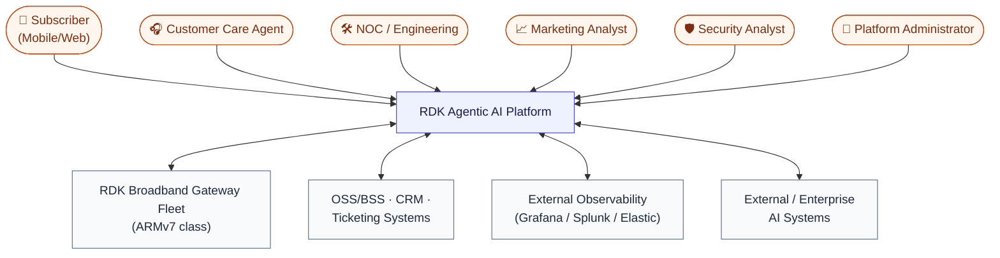
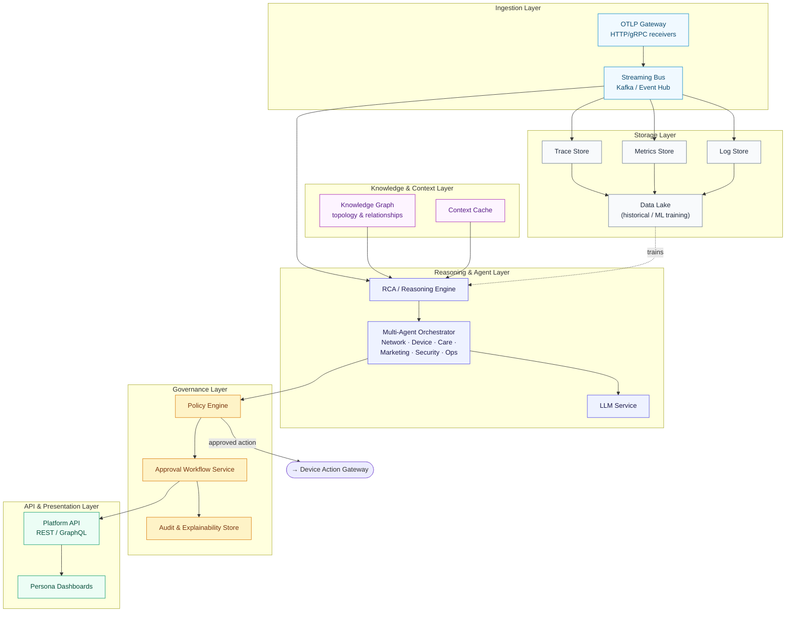
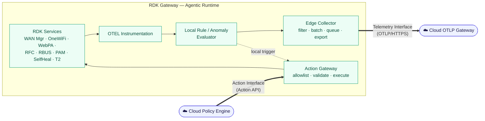
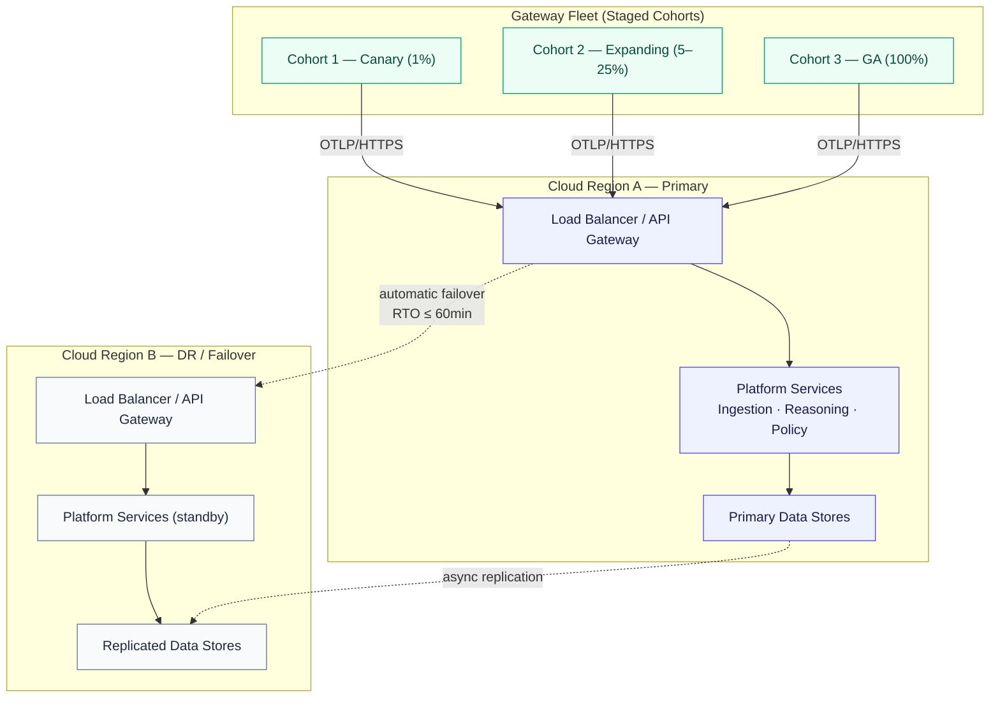
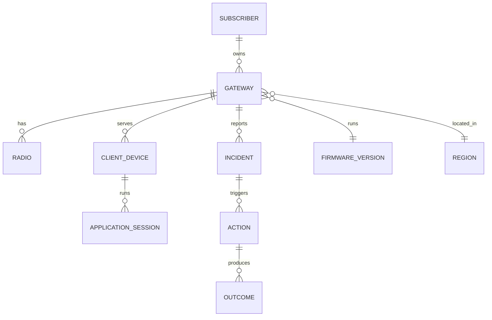
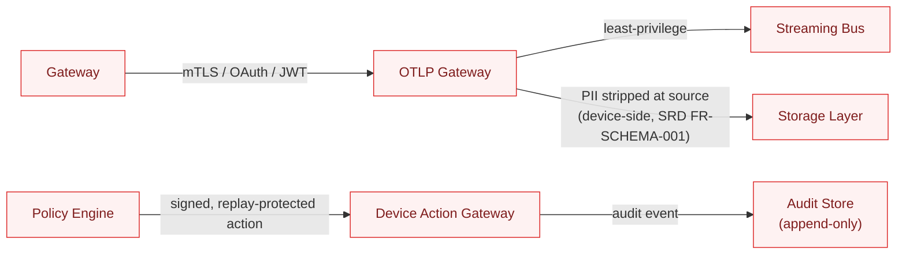
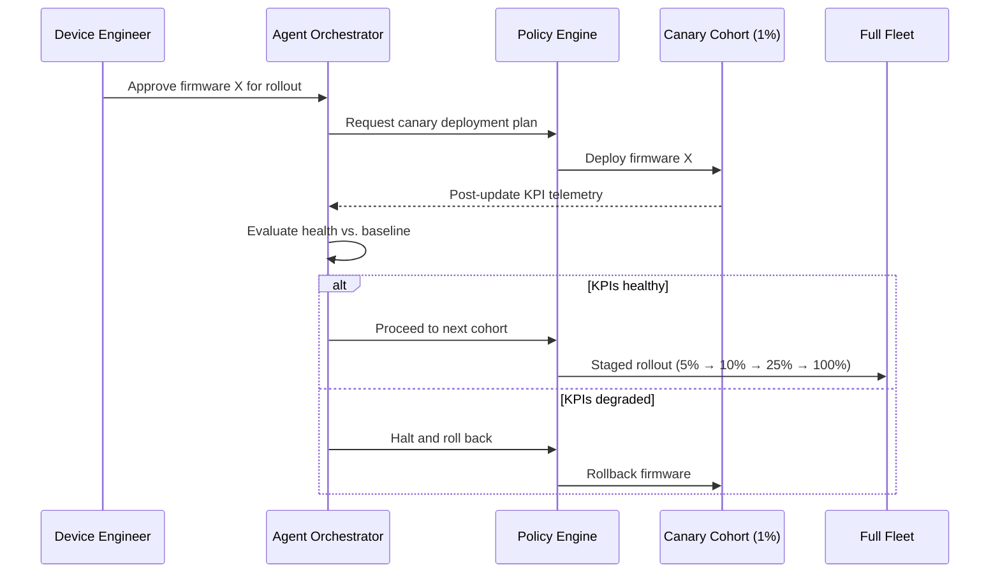
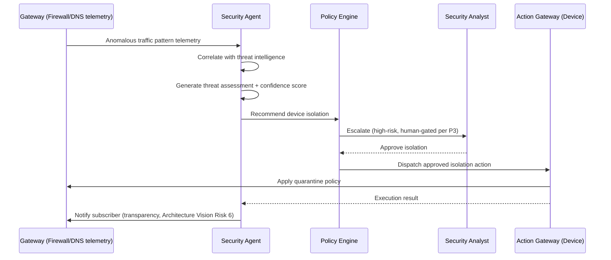

# High-Level Design (HLD)
## RDK Agentic AI Platform — Hybrid Cloud/Edge

**Document Version:** 1.0
**Document Type:** High-Level Design
**Governed By:** [Architecture_Vision_Strategy.md](./Architecture_Vision_Strategy.md)
**Implements:** [Final_SRD_Agentic_AI_RDK_Hybrid.md](./Final_SRD_Agentic_AI_RDK_Hybrid.md)
**Audience:** Engineering leads, platform architects, device/cloud implementation teams

---

## 1. Purpose & Scope

This document translates the ratified architecture principles (P1–P8) and decisions (AD-01–AD-09) from the Architecture Vision into a concrete component-level design: what services exist, what they're responsible for, how they talk to each other, and what technology is proposed for each. It does **not** go to module/class/schema-field detail — that is Low-Level Design (LLD), the next phase.

Every component defined here traces back to functional requirement IDs in the SRD (Section 14, Requirement Traceability Matrix) and respects the non-negotiable constraints in Architecture Vision Section 7 (device resource budgets, no on-device LLM/KG/multi-agent runtime, mandatory human gate on irreversible actions).

---

## 2. Design Goals

| Goal | Source |
|---|---|
| Device footprint stays within hard limits regardless of cloud-side feature growth | AD-01, AD-02, SRD §2.3 |
| Cloud tier scales horizontally to 500M+ devices without device-side changes | SRD §9.2 |
| Every component can be independently disabled/rolled back without cross-component failure | P7, AD-06 |
| No single component holds unaudited authority to mutate a subscriber's network | P3, P4, AD-03 |
| Design accommodates operator/HAL variation without forking cloud logic | P8 |

---

## 3. System Context Diagram



---

## 4. Component Architecture — Cloud Tier



### 4.1 Cloud Component Responsibilities

| Component | Responsibility | Key SRD Requirements |
|---|---|---|
| OTLP Gateway | Terminate device OTLP/HTTPS connections; auth; rate-limit per device | FR-TEL-001, NFR-SEC-001/007 |
| Streaming Bus | Decouple ingestion from processing; durable buffering at cloud scale | NFR-SCALE-003, NFR-REL-002 |
| Trace/Metrics/Log Store | Queryable observability backends for engineering + RCA input | FR-TEL-002, NFR-OBS-001 |
| Data Lake | Long-term retention for trend analysis, RCA training, capacity planning | FR-TEL-003, NFR-COMP-001 |
| Knowledge Graph | Subscriber↔Gateway↔Radio↔Device↔Application↔Cloud-Service topology | FR-AI-002 (fills Gap 1 in SRD §14) |
| Context Cache | Low-latency recent-state lookup for reasoning engine | Supports FR-AI-003 latency target |
| RCA / Reasoning Engine | Root-cause analysis, confidence scoring | FR-AI-003/004, NFR-PERF (RCA < 30s) |
| Multi-Agent Orchestrator | Coordinates Network/Device/Care/Marketing/Security/Ops agents | FR-AGENT-001/002/003 |
| LLM Service | Natural-language reasoning, subscriber/care NL interfaces | FR-SS-001, NFR-UX-002 |
| Policy Engine | Risk-based auto-approve vs. escalate decision | FR-AUTO-002, FR-SAFE-001/002 |
| Approval Workflow Service | Human-in-the-loop queueing, multi-stage approval | FR-GOV-004 |
| Audit & Explainability Store | Immutable decision/action/outcome ledger | FR-GOV-001/002/003 |
| Platform API | Unified access for dashboards, mobile app, external AI systems | FR-AGENT-003, NFR-UX |
| Persona Dashboards | Role-specific UI (Subscriber, Care, NOC, Eng, Marketing, Security, Admin) | SRD §7.5 |

---

## 5. Component Architecture — Device Tier

The device tier design is unchanged from the detailed workflow already specified in the SRD; this HLD treats it as one integrated subsystem exposing two external interfaces (telemetry-out, action-in) to the cloud.



*Full internal workflow, device-side use-case diagram, and telemetry/action data-flow detail already documented in SRD §6.0–§6.0.2 — not duplicated here.*

---

## 6. Deployment Architecture



**Design notes:**
- Multi-region active/standby satisfies NFR-AVA-001 (99.99%) and NFR-AVA-004 (RPO ≤ 15min, RTO ≤ 60min).
- Gateway cohorts map directly to the SRD §12 phased rollout — cohort membership is a deployment-time property, not a code branch, so the same binary serves canary and GA fleets.
- No device-to-device or device-to-region affinity is required; any gateway can reconnect to any regional endpoint on failover (stateless device-side design, per P1).

---

## 7. Interface Design

### 7.1 Device ↔ Cloud Interfaces

| Interface | Direction | Protocol | Payload | Governing Requirement |
|---|---|---|---|---|
| Telemetry Export | Device → Cloud | OTLP/HTTPS (TLS 1.2+) | Spans, health events (SRD §8 schema) | FR-DEV-002/005, NFR-SEC-001 |
| Action Dispatch | Cloud → Device | Action API (HTTPS, authenticated) | Action recommendation schema (SRD §8) | FR-AUTO-002, FR-SAFE-001 |
| Execution Result | Device → Cloud | Same channel as telemetry export | Action execution schema (SRD §8) | FR-DEV-021 |
| Outcome Verification | Device → Cloud | Same channel | Verification schema (SRD §8) | FR-DEV-021, FR-AUTO-005 |
| Configuration / RFC | Cloud → Device | RFC control channel | Sampling rate, endpoint, kill switch | FR-DEV-023/024 |

All four data-bearing message types share the minimal OTLP schema already defined in SRD §8 — this HLD does not introduce a second schema; it only assigns each schema to a transport interface.

### 7.2 Cloud-Internal Interfaces

| Interface | Between | Style | Notes |
|---|---|---|---|
| Ingestion → Storage | OTLP Gateway / Streaming Bus → Trace/Metric/Log Stores | Async, event-driven | Decouples ingestion spikes from storage write capacity |
| Reasoning → Knowledge Graph | RCA Engine ↔ Knowledge Graph | Synchronous query API | Latency-sensitive (RCA < 30s target) |
| Orchestrator → Agents | Multi-Agent Orchestrator ↔ specialized agents | Internal message bus / RPC | Supports FR-AGENT-002 context/finding exchange |
| Orchestrator → Policy Engine | Agents → Policy Engine | Synchronous request/response | Every recommendation passes through policy before dispatch (P3) |
| Policy → Approval Workflow | Policy Engine → Approval Service | Async (queued) for escalations, sync for auto-approve | FR-GOV-004 multi-stage support |
| Platform API → External Systems | Platform API ↔ OSS/BSS, external AI | REST/GraphQL, authenticated | FR-AGENT-003 interoperability |

---

## 8. Data Architecture

### 8.1 Telemetry Data Model
Governed entirely by the minimal OTLP schema in SRD §8 (device resource attributes, span schema, health-event schema, action/verification schemas). HLD adds no new telemetry fields — schema discipline (P5, one shape per category) is a hard constraint carried forward from the Architecture Vision.

### 8.2 Knowledge Graph Data Model



This closes **Gap 1 (Knowledge Graph / Service Topology Model)** identified in SRD §14 — without it, the platform can observe ("DNS failures increased") but not reason causally ("DNS failures → buffering → care calls → churn risk").

### 8.3 Storage Tiering & Retention

| Tier | Store | Data | Retention Strategy |
|---|---|---|---|
| Hot | Trace/Metric/Log stores | Recent telemetry for live RCA | Short (days), high query performance |
| Warm | Knowledge Graph + Context Cache | Active topology, recent incidents | Continuously updated, bounded by KG refresh cadence |
| Cold | Data Lake | Historical telemetry, training data | Long-term, configurable per NFR-COMP-001 |
| Immutable | Audit & Explainability Store | Every decision/action/approval record | Retained per compliance policy, append-only |

---

## 9. Technology Stack

Where the Architecture Vision left a decision explicitly open (AD-07/AD-08), this HLD proposes a default and flags it as a **recommendation pending ratification**, not a final choice.

| Layer | Proposed Technology | Status |
|---|---|---|
| Device collector | Custom lightweight C/C++ (not OTEL Collector Go build) | **Adopted** (AD-02) |
| Device↔Cloud transport | OTLP over HTTPS, TLS 1.2+ | **Adopted** |
| Streaming bus | Kafka (or managed equivalent, e.g. Event Hub) | Proposed |
| Trace store | Tempo or Jaeger | **Open — AD-08**, pending backend selection |
| Metrics store | Prometheus/Mimir-compatible | Proposed |
| Log store | Elastic or Loki | Proposed |
| Knowledge Graph | Graph database (e.g., Neo4j) or hybrid graph/relational | **Open — Architecture Vision §8 item 4** |
| LLM / Reasoning | Azure OpenAI, internal LLM, or hybrid | **Open — AD-07** |
| Multi-agent orchestration | Internal orchestrator service (framework TBD at LLD) | Proposed |
| Dashboards/API | REST/GraphQL API + persona-specific web/mobile UI | Proposed |

**Action for architecture review board:** ratify AD-07, AD-08, and the Knowledge Graph technology choice before LLD begins on the Reasoning and Knowledge Graph components — these choices materially affect the interface contracts in §7.2.

---

## 10. Resilience & Scalability Patterns

| Pattern | Applied Where | Purpose |
|---|---|---|
| Backpressure + bounded queue | Device Edge Collector (SRD FR-DEV-008), cloud Streaming Bus | Prevent OOM/overload during traffic bursts or endpoint outage |
| Bounded exponential retry | Device export (FR-DEV-009), cloud→device action dispatch | Avoid tight retry loops (explicit NFR-REL requirement) |
| Circuit breaker | Cloud service-to-service calls (Orchestrator↔Agents↔Policy) | Contain cascading failure across agent services |
| Canary + staged rollout | Fleet deployment (§6), firmware rollout (§12.1 sequence) | Bound blast radius of a bad decision (FR-SAFE-007) |
| Idempotent action execution | Action Gateway (FR-DEV-016) | Safe retry of action dispatch without double-execution |
| Multi-region active/standby | Cloud deployment (§6) | Meets 99.99% availability, RPO/RTO targets |
| Horizontal auto-scaling | Ingestion, Streaming Bus, Reasoning Engine | Meets 500M+ device / 100M+ events-per-hour scale target |

---

## 11. Security Architecture



- **Authentication:** device↔cloud via mTLS/OAuth/JWT (NFR-SEC-007); operator/admin console access via RBAC + MFA (NFR-SEC-003/004).
- **PII handling:** enforced at telemetry *generation*, not filtered downstream — the device never creates the field (NFR-SEC-006, FR-SCHEMA-001). No cloud-side "scrubbing" component is required or trusted as the primary control.
- **Action integrity:** every action carries a unique action ID (idempotency) and is bound to an audit record before dispatch (FR-GOV-003, FR-SAFE-003).
- **Least privilege:** collector and action gateway are separately privileged on-device — a compromised collector cannot execute actions (Architecture Vision §5.5).

---

## 12. Key Interaction Scenarios

### 12.1 Fleet-Wide Firmware Rollout (Canary)



### 12.2 Security Threat Detection & Isolation



### 12.3 Cloud Endpoint Outage & Recovery

```mermaid
sequenceDiagram
    participant DEV as Device Collector
    participant Q as Bounded Persistent Queue
    participant CLOUD as Cloud OTLP Gateway

    DEV->>CLOUD: Export telemetry
    CLOUD--xDEV: Endpoint unreachable
    DEV->>Q: Buffer telemetry (bounded, ≤24 MiB per SRD §2.3)
    loop Bounded exponential backoff
        DEV->>CLOUD: Retry export
        CLOUD--xDEV: Still unreachable
    end
    CLOUD->>DEV: Endpoint restored
    DEV->>CLOUD: Drain queue (rate-limited, no CPU/network storm)
    CLOUD-->>DEV: Ack
    Note over DEV,Q: Queue never exceeds configured cap (FR-DEV-008);<br/>oldest-record expiry applies if still full
```

---

## 13. HLD-Level Design Decisions

These are more granular than the Architecture Vision's ADRs and specific to this design pass.

| # | Decision | Rationale |
|---|---|---|
| HLD-01 | Streaming bus sits between OTLP Gateway and storage/reasoning, rather than reasoning consuming directly from the gateway | Decouples ingestion burst handling from downstream processing rate; required at 500M-device scale |
| HLD-02 | Policy Engine is a single choke point for *all* action dispatch, including agent-generated and locally-rule-triggered low-risk actions | Enforces P3/P4 uniformly — no code path bypasses governance, even for "safe" actions |
| HLD-03 | Knowledge Graph is queried synchronously by the Reasoning Engine but updated asynchronously from telemetry | Balances the < 30s RCA latency target against the impracticality of synchronous graph writes at ingestion volume |
| HLD-04 | Device tier exposes exactly two external interfaces (telemetry-out, action-in) — no third-party service talks to the gateway directly | Preserves P8 portability; keeps operator/HAL variation isolated behind the existing device-side abstraction |
| HLD-05 | Audit Store is architecturally separate from the Approval Workflow Service, not a table within it | An approval-service outage or bug must not be able to lose or alter audit history |

---

## 14. Requirement Traceability Matrix

| HLD Component | SRD Requirement Prefixes |
|---|---|
| Device Runtime (Instrumentation, Collector, Rules, Action Gateway) | FR-DEV-xxx, FR-BUD-xxx, NFR-HW-xxx |
| OTLP Gateway / Streaming Bus / Storage Layer | FR-TEL-xxx, NFR-SCALE-xxx, NFR-REL-xxx |
| Knowledge Graph / Context Cache | FR-AI-002, Gap 1 (SRD §14) |
| RCA / Reasoning Engine, LLM Service | FR-AI-xxx |
| Multi-Agent Orchestrator | FR-AGENT-xxx |
| Policy Engine / Approval Workflow / Audit Store | FR-AUTO-xxx, FR-GOV-xxx, FR-SAFE-xxx |
| Platform API / Dashboards | NFR-UX-xxx, SRD §7.5 |
| Deployment (multi-region) | NFR-AVA-xxx |
| Security Architecture | NFR-SEC-xxx, FR-SCHEMA-001 |

---

## 15. Open Items Before LLD

1. Ratify AD-07 (LLM/AI platform), AD-08 (OTEL backend), and Knowledge Graph technology (Architecture Vision §8) — blocks LLD on Reasoning and Knowledge Graph components.
2. Confirm multi-agent orchestration framework/library choice (§9 lists as "TBD at LLD").
3. Define exact Action API contract (request/response schema, error codes, versioning) — currently specified only at the payload-schema level (SRD §8).
4. Define Knowledge Graph refresh cadence and consistency guarantees (HLD-03 assumes async update; exact SLA needs LLD-level definition).
5. Confirm canary cohort sizing/promotion thresholds as concrete, monitored metrics (currently qualitative "KPIs healthy" in §12.1).

---

*This HLD should be reviewed against the Architecture Vision's open decisions (Section 8 there) before component-level LLD work begins. Diagrams use Mermaid and render natively in GitHub, VS Code, and most markdown viewers.*
