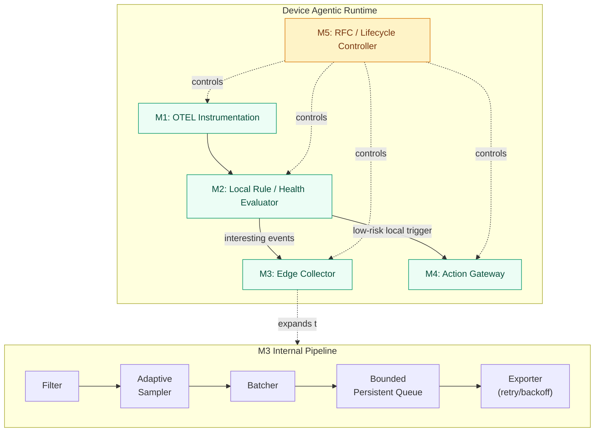
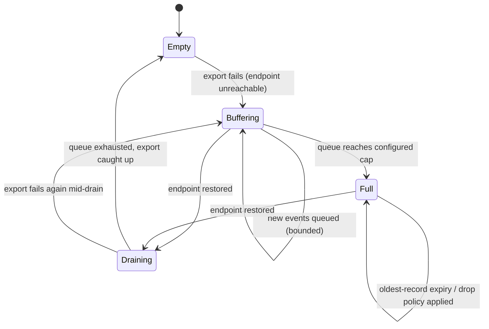
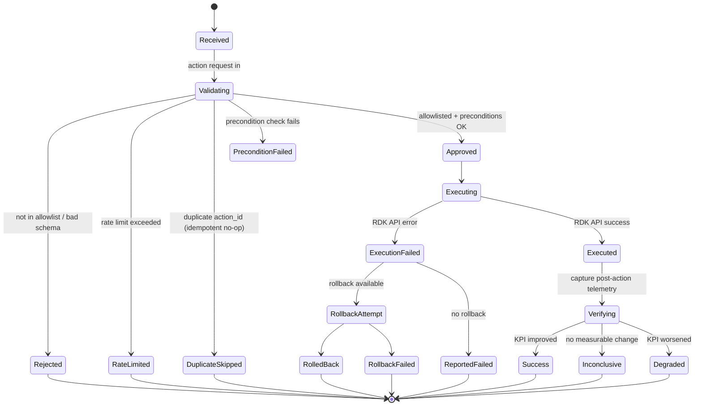
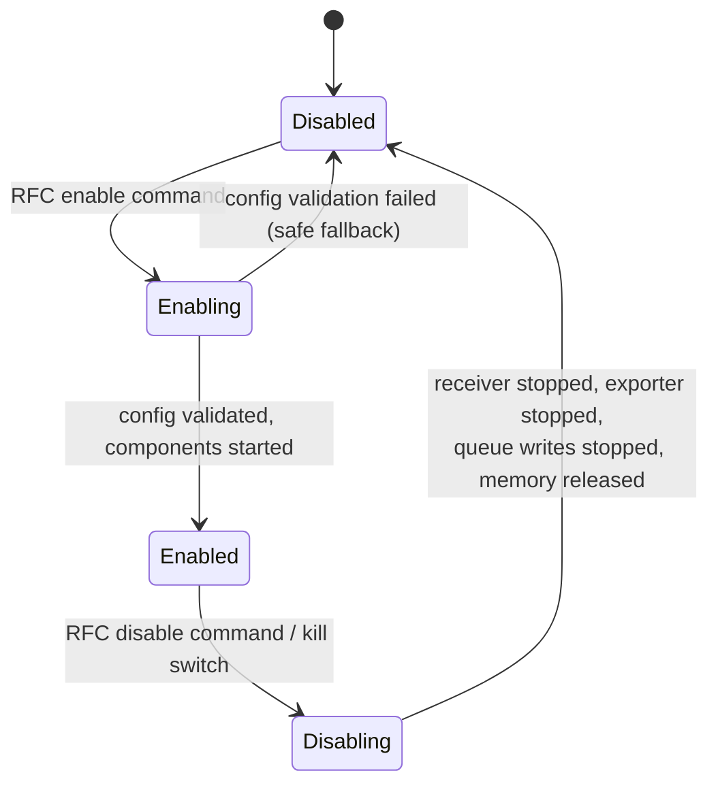
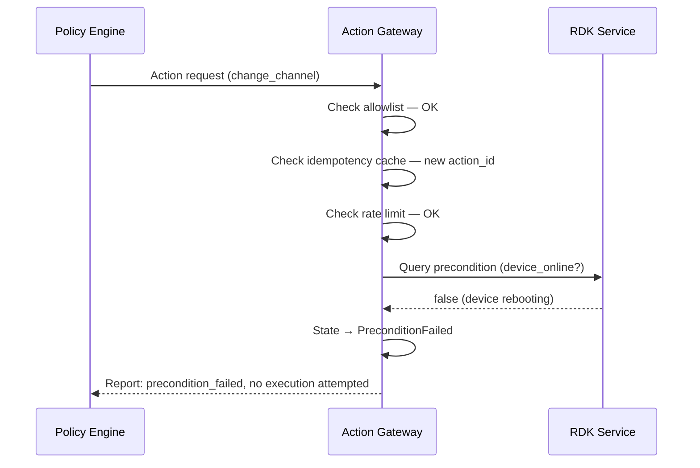
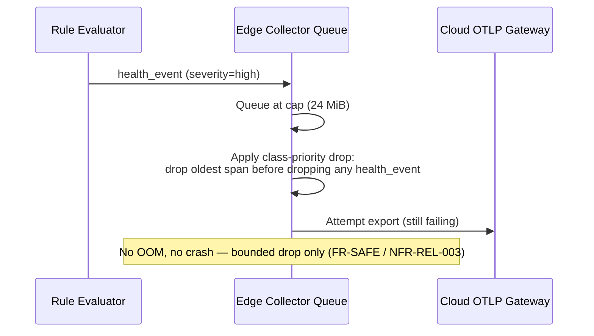

# Low-Level Design (LLD)
## RDK Agentic AI Platform — Device Runtime & Core Interfaces

**Document Version:** 1.0
**Document Type:** Low-Level Design
**Governed By:** [High_Level_Design_Agentic_AI_RDK.md](./High_Level_Design_Agentic_AI_RDK.md), [Architecture_Vision_Strategy.md](./Architecture_Vision_Strategy.md)
**Implements:** [Final_SRD_Agentic_AI_RDK_Hybrid.md](./Final_SRD_Agentic_AI_RDK_Hybrid.md)
**Audience:** Implementation engineers (device firmware + cloud services)

---

## 1. Purpose & Scope

This document specifies implementation-level detail for the components the HLD left as black boxes: module decomposition, state machines, message schemas with exact field types, algorithms, configuration parameters, and error taxonomy.

**In scope:** all five device-side modules (fully specified — unblocked by any open decision), the Telemetry Export / Action Dispatch / Action Result message contracts, and the cloud-side algorithms that are technology-agnostic (Policy Engine risk scoring, Knowledge Graph interface contract).

**Out of scope:** Knowledge Graph internal schema and Reasoning Engine/LLM internals — these depend on the technology choices still open per HLD §9 and §15 (AD-07, AD-08, KG technology). Where cloud-side LLD is needed but the technology isn't ratified, this document specifies the **interface contract and algorithm**, not the implementation, so device-side work is not blocked.

---

## 2. Device Module Decomposition



---

## 3. Module Specifications

### 3.1 M1 — OTEL Instrumentation Module

**Responsibility:** create spans/metrics/events at instrumented RDK call sites; inject/extract W3C Trace Context across IPC boundaries.

**Interface (internal, called by instrumented RDK components):**

```c
span_t* otel_start_span(const char* component, const char* operation, span_t* parent);
void    otel_end_span(span_t* span, span_status_t status);
void    otel_add_attribute(span_t* span, const char* key, const value_t* val);
void    otel_inject_context(span_t* span, ipc_headers_t* out_headers);
span_t* otel_extract_context(const ipc_headers_t* in_headers);
```

**Constraints (from SRD §2.4, §6.1):**
- No-op fast path: when M5 reports `disabled`, every call above returns immediately with zero allocation (NFR-HW-003).
- Attribute count, value length, and event count per span are capped (prevents an unbounded span from a misbehaving caller) — default caps: 16 attributes, 256 bytes/value, 8 events/span.
- Instrumentation is applied only to the approved MVP call sites (WAN Manager, OneWiFi, WebPA, RFC, RBUS, PAM, SelfHeal) — enforced at build time via an explicit instrumentation manifest, not runtime discovery.

### 3.2 M2 — Local Rule / Health Evaluator Module

**Responsibility:** evaluate deterministic rules and lightweight ML models against live telemetry; decide "noise vs. interesting"; may emit a local low-risk action trigger.

**Rule schema:**
```json
{
  "rule_id": "rssi_low",
  "condition": "rssi < -75",
  "severity": "medium",
  "action_on_match": "emit_health_event",
  "cooldown_seconds": 300
}
```

**Conflict resolution algorithm** (prevents rule storms / action loops per FR-SAFE-004):
```
on telemetry_sample(s):
    matched = [r for r in rules if r.condition(s) and not r.in_cooldown()]
    if matched is empty: return NOISE

    highest = max(matched, key = r.severity)
    highest.start_cooldown()

    if highest.action_on_match == "emit_health_event":
        forward_to(M3)
    elif highest.action_on_match == "trigger_local_action":
        if highest.action_type in LOCAL_AUTONOMOUS_ALLOWLIST:
            forward_to(M4, action_request(highest.action_type))
        else:
            forward_to(M3, health_event(severity=highest.severity))  // escalate to cloud instead
```

- **Only one action is triggered per evaluation cycle**, even if multiple rules match — this is the primary loop-prevention control at the rule layer (complements M4's own rate limiting).
- Local ML models (decision tree / isolation forest) plug in as additional `rule` entries whose `condition` is a model inference call; same cooldown and single-trigger discipline applies.

### 3.3 M3 — Edge Collector Module

**Sub-pipeline:** `Filter → Adaptive Sampler → Batcher → Bounded Persistent Queue → Exporter`

**Adaptive sampling algorithm:**
```
baseline_sample_rate = 0.01     // 1%, RFC-configurable
incident_sample_rate = 1.0      // 100%, RFC-configurable
incident_window_seconds = 300   // RFC-configurable

on health_event(e):
    if e.severity >= INCIDENT_THRESHOLD:
        collector.sample_rate = incident_sample_rate
        reset_timer(incident_window_seconds)

on incident_timer_expire():
    collector.sample_rate = baseline_sample_rate
```

**Queue state machine** (bounded persistent queue, hard cap 24 MiB per SRD §2.3):



**Drop policy when Full:** FIFO expiry (oldest record dropped first). Health events (small, high-value) are never dropped ahead of raw spans — the queue prioritizes by record class (`health_event` > `action_result` > `span`) before falling back to FIFO within a class.

**Exporter retry/backoff formula:**
```
delay_ms = min(max_delay_ms, base_delay_ms * 2^attempt) + random(0, base_delay_ms)
```
Defaults: `base_delay_ms = 2000`, `max_delay_ms = 300000` (5 min cap), reset `attempt` to 0 on any successful export. This bounds retries per NFR-REL-002/FR-DEV-009 — never a tight loop.

**Drain-on-recovery control:** on endpoint restoration, drain proceeds at a rate-limited pace (max N batches/second, RFC-configurable) specifically to satisfy the "no CPU/network storm on recovery" requirement (SRD §13.1, Collector reliability).

### 3.4 M4 — Action Gateway Module

**State machine:**



**Allowlist catalog schema** (one entry per action type — this is the formal "Remediation Service Catalog" that SRD Gap 8 identifies as missing):
```json
{
  "action_type": "restart_wifi",
  "risk_tier": "low",
  "autonomous_allowed": true,
  "requires_human_approval": false,
  "rollback_available": false,
  "rate_limit_per_device_per_hour": 3,
  "target_component": "OneWiFi",
  "target_api": "wifi.restart",
  "preconditions": ["device_online", "no_action_in_flight"]
}
```

Actions such as `factory_reset`, `firmware_rollback`, `mass_config_change` are present in the catalog with `autonomous_allowed: false` and `requires_human_approval: true` **permanently** — this is a data-driven enforcement of Architecture Vision constraint C3, not a code branch that could be silently changed.

**Idempotency algorithm:**
```
on action_request(action_id, action_type, params):
    if action_id in recent_action_cache:            // TTL 24h, bounded LRU
        return cached_result                         // no re-execution, satisfies FR-DEV-016
    recent_action_cache[action_id] = PENDING
    proceed_to_validate(action_type, params)
```

**Rate limiting:** per-`action_type` token bucket, refill rate = `rate_limit_per_device_per_hour` from the allowlist entry. A request exceeding the bucket transitions to `RateLimited` and is reported, not silently dropped (auditability).

**Precondition validation:** executed synchronously immediately before `Executing`; failure short-circuits to `PreconditionFailed` without touching the target RDK API — before-state is only captured once preconditions pass, minimizing wasted telemetry.

### 3.5 M5 — RFC / Lifecycle Controller Module

**State machine:**



**Configuration schema (full RFC parameter reference):**

| Parameter | Type | Default | Notes |
|---|---|---|---|
| `master_enable` | bool | `false` | Global kill switch; overrides all other settings |
| `component_trace_enable` | map\<string,bool\> | all `false` | Per-RDK-component instrumentation toggle |
| `sampling_rate_baseline` | float | `0.01` | See M3 adaptive sampling |
| `sampling_rate_incident` | float | `1.0` | See M3 adaptive sampling |
| `incident_window_seconds` | int | `300` | See M3 adaptive sampling |
| `collector_endpoint_url` | string | — | Cloud OTLP ingestion endpoint |
| `queue_size_limit_mb` | int | `16` | Hard cap enforced independently at 24 MiB (SRD §2.3) |
| `batch_size_max_spans` | int | `200` | Also capped at 256 KiB, whichever first |
| `batch_timeout_ms` | int | `3000` | 1–5s range per SRD §2 |
| `retry_base_delay_ms` | int | `2000` | See M3 backoff formula |
| `retry_max_delay_ms` | int | `300000` | See M3 backoff formula |
| `action_rate_limits` | map\<string,int\> | see allowlist | Overridable per action_type, never above catalog ceiling |

**Config validation rule:** any malformed or out-of-bound value causes the *entire* config push to be rejected and the device to remain in (or revert to) its last-known-good state — never a partial apply (safe fallback, SRD §13 checklist).

---

## 4. Message Contracts

### 4.1 Telemetry Export (Device → Cloud)

```
POST {collector_endpoint_url}/v1/telemetry
Content-Type: application/x-protobuf  (OTLP native) or application/json (fallback)
Authorization: mTLS client certificate, or Bearer JWT
```

Body: batch of records, each one of the four record types defined in SRD §8 (device resource attributes sent once per batch; span; health event). Batch size bounded per M3 (§3.3).

**Response codes:**
| Code | Meaning | Device Behavior |
|---|---|---|
| `200 OK` | `{ "accepted": n, "rejected": n }` | Dequeue accepted records; requeue rejected (if `rejected > 0`, log reason) |
| `429 Too Many Requests` | Cloud-side rate limiting | Apply `Retry-After` header, do not increment attempt counter beyond backoff cap |
| `401/403` | Auth failure | Enter `AUTH_FAILED` error state, alert via local diagnostic log, do not retry until cert/token refreshed |
| `503 Service Unavailable` | Endpoint down | Standard M3 backoff/queue path |

### 4.2 Action Dispatch (Cloud → Device)

Consistent with RDK's existing management channel — actions are **pushed** via the WebPA/XMidt WRP path, not pulled via an inbound REST call, because M3's receiver is loopback-only (FR-DEV-006: no externally reachable receiver on-device).

**WRP message envelope (conceptual):**
```json
{
  "msg_type": "SimpleEvent",
  "source": "cloud-policy-engine",
  "dest": "mac:<device_id>/agentic-action-gateway",
  "content_type": "application/json",
  "payload": {
    "action_id": "a123",
    "device_id": "gateway-id",
    "action_type": "restart_wifi",
    "reason": "channel_congestion",
    "confidence": 92,
    "approved": true,
    "schema_version": "1.0"
  }
}
```

Delivered to M4 via the existing WebPA agent on-device; M4 does not open any new inbound network surface.

### 4.3 Action Result & Verification (Device → Cloud)

Reuses the telemetry export channel (§4.1) with `record_type: action_result` and `record_type: action_verification`, per the schemas already defined in SRD §8. No separate transport is introduced — this keeps M3 as the single egress path for every device-originated message (HLD-04).

### 4.4 Versioning & Compatibility

- Every payload carries `schema_version`. The device must accept a cloud response using any minor version it recognizes and reject (log, do not crash) an unrecognized major version.
- Backward compatibility window: cloud services must accept the previous major schema version for at least one full fleet-rollout cycle (SRD §12 phases) to accommodate devices that haven't yet received a firmware update.

---

## 5. Cloud-Side Algorithmic Design (Technology-Agnostic)

These specify **behavior**, not implementation — the underlying technology (LLM platform, graph DB) remains an open decision per HLD §9/§15.

### 5.1 Policy Engine — Risk Scoring & Approval Algorithm

```
function evaluate(recommendation):
    catalog_entry = allowlist_catalog.lookup(recommendation.action_type)
    if catalog_entry is null:
        return REJECT("unknown action_type")

    if not catalog_entry.autonomous_allowed:
        return ESCALATE(reason="action requires human approval by policy")

    if recommendation.confidence < catalog_entry.min_confidence_threshold:
        return ESCALATE(reason="confidence below threshold")

    if blast_radius(recommendation) > SINGLE_DEVICE:
        return ESCALATE(reason="multi-device blast radius requires canary/staged approval")

    return AUTO_APPROVE
```

`min_confidence_threshold` is a per-action-type configurable value in the same allowlist catalog referenced by M4 (§3.4) — cloud and device share one source of truth for what is "low-risk," rather than maintaining two independent lists.

### 5.2 Knowledge Graph — Interface Contract

Regardless of eventual backing technology, the Reasoning Engine depends on this contract:

```
interface KnowledgeGraph:
    query_topology(device_id) -> { subscriber, gateway, radios[], client_devices[], applications[] }
    query_fleet_peers(firmware_version, region) -> [device_id]
    record_incident(device_id, incident) -> incident_id
    record_outcome(action_id, before, after, outcome)
```

**Update cadence (HLD-03 resolved to a concrete SLA):**
- Topology relationships (subscriber↔gateway↔device): updated on provisioning/inventory change events — near-real-time, event-driven.
- Incident/outcome records: written synchronously by the Reasoning Engine at decision time (these are what make RCA explainable — never batched/delayed).
- Fleet-peer aggregates (used for correlation, SRD FR-FLEET-001): refreshed on a bounded cadence (target: ≤5 minutes staleness) — acceptable because fleet correlation tolerates near-real-time, not hard-real-time, consistency.

### 5.3 RCA Confidence Scoring — Required Inputs

Whatever reasoning technology is selected must accept, at minimum, these inputs to produce a confidence score (this is the contract LLD fixes now so device/telemetry design doesn't have to change later regardless of which LLM/platform is picked):
- Telemetry completeness for the affected device/window (SRD Assumption Q14–Q17)
- Fleet-peer correlation result (§5.2)
- Historical outcome data for similar prior recommendations (feedback loop from §4.3)

---

## 6. Error Taxonomy

| Code | Layer | Meaning | Recovery |
|---|---|---|---|
| `NETWORK_UNAVAILABLE` | M3 | Endpoint unreachable | Queue + backoff (§3.3) |
| `AUTH_FAILED` | M3 | mTLS/JWT rejected | Stop export, alert, no retry until credential refresh |
| `RATE_LIMITED` | M3, M4 | Cloud 429 or local token bucket exhausted | Backoff (M3) / report + skip (M4) |
| `PRECONDITION_FAILED` | M4 | Device state doesn't meet action preconditions | Reject, report to cloud, no execution |
| `DUPLICATE_ACTION` | M4 | Repeated action_id | Return cached result, no re-execution |
| `EXECUTION_FAILED` | M4 | Target RDK API returned error | Attempt rollback if available, else report failed |
| `VERIFICATION_TIMEOUT` | M4 | Post-action telemetry didn't stabilize in time | Report `Inconclusive`, do not retry action automatically |
| `ROLLBACK_FAILED` | M4 | Rollback API also failed | Escalate to cloud as critical, flag device for manual review |
| `CONFIG_INVALID` | M5 | RFC push failed validation | Reject entire config, retain last-known-good (§3.5) |

---

## 7. Sequence Diagrams — Edge Cases

### 7.1 Action Rejected — Precondition Failure



### 7.2 Queue Full — Drop Policy Activation



---

## 8. Module-Level Observability

Each module exposes its own metric set so field issues are attributable to a specific module, not just "the agentic runtime":

| Module | Required Self-Metrics |
|---|---|
| M1 | spans_created, spans_dropped_cap_exceeded, instrumentation_overhead_ns |
| M2 | rules_evaluated, rules_matched, actions_triggered_locally, cooldown_skips |
| M3 | queue_depth_bytes, export_success_total, export_failure_total, current_sample_rate, drain_rate |
| M4 | actions_received, actions_rejected (by reason), actions_executed, actions_rolled_back, rate_limit_hits |
| M5 | config_pushes_total, config_rejections_total, current_state (enabled/disabled) |

These metrics themselves flow through M3 as a distinct low-cardinality record type, staying inside the resource budgets already fixed in SRD §2.4 — self-observability is not an unbudgeted addition.

---

## 9. Traceability to HLD / SRD

| LLD Section | HLD Reference | SRD Requirement IDs |
|---|---|---|
| M1 Instrumentation | HLD §5 Device Tier | FR-DEV-001/002/003/004 |
| M2 Rule Evaluator | HLD §5 | FR-DEV-012/013/014 |
| M3 Edge Collector | HLD §5, HLD-01 | FR-DEV-005–011 |
| M4 Action Gateway | HLD §5, HLD-02 | FR-DEV-015–022, FR-SAFE-001–007 |
| M5 Lifecycle Controller | HLD §5 | FR-DEV-023/024/025, NFR-HW-003 |
| §4 Message Contracts | HLD §7.1 | SRD §8 schema |
| §5.1 Policy Engine algorithm | HLD §4, HLD-02 | FR-AUTO-002/003 |
| §5.2 Knowledge Graph contract | HLD §4, HLD-03 | FR-AI-002 |

---

## 10. Open Items for Implementation

1. Exact wire format decision (protobuf vs. JSON) for the telemetry export path — affects M1/M3 encoding overhead within the resource budget.
2. Confirm WebPA/XMidt WRP as the action-dispatch transport (§4.2) with the WebPA platform team — this LLD assumes it based on existing RDK cloud-interaction patterns noted in source material, but it has not been explicitly ratified.
3. Finalize `min_confidence_threshold` and `rate_limit_per_device_per_hour` default values per action type in the shared allowlist catalog (§3.4/§5.1) — currently placeholders, need operator/architecture sign-off.
4. Local ML model format and inference runtime for M2 (decision tree / isolation forest) — needs a concrete library selection sized against the 20–50 MB budget (SRD §2.4).
5. Knowledge Graph technology selection remains blocking for §5.2 implementation (unchanged from HLD §15, item 1).

---

*Diagrams use Mermaid and render natively in GitHub, VS Code, and most markdown viewers. This LLD should be implementable for all device-side modules (M1–M5) without waiting on the cloud technology decisions in HLD §15 — those only block §5's cloud-side implementation.*
